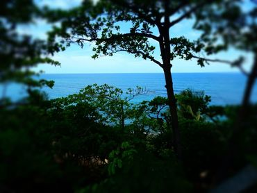

Originally this blog post was originally posted on [Aquatic Thoughts...](https://wetlandbiogeochem.weebly.com/aquatic-thoughts). 

***


```{r, out.width="50%",echo=FALSE,fig.align="center"}

```
<center>Seeing the trees through the tropical forest, San Juan, Puerto Rico.</center>

<br>
Last week I was fortunate enough to attend the 2017 Society of Wetland Scientist ([SWS](sws.org)) annual meeting in San Juan Puerto Rico. As usual the conference was an amazing gather of wetland and aquatic scientists from all around the globe discussing the various types and facets of wetland ecology, management and policy. 

All week I have been reflecting on my time at the conference, tonight while preparing dinner (vegan cabbage kofta) I took a deeper reflection on the meeting. Over the past several years (10 + years) I have read countless journal articles on wetlands, biogeochemistry, hydrology, modeling, etc. Through all this reading I was bound to come across several names more than once. This is true for any field. 

I am lucky in that I get the chance to collaborate with some of the best in the field of wetland ecology, biology, biogeochemistry, management and policy with my experience related to Everglades science and policy both as part of my position as the Florida Department of Environmental Protection and as part of my studies with the University of Florida. I am truly gifted to be in the company such amazing scientists. 

In the past I have had less than fulfilling interactions with eminent scholars. Even on the onset of saying hello it appeared to be a waste of their time as indicated by their exasperated responses. Which in turn quickly discouraged me from attempting to interact with the big names in science, kept my distance and read from the sidelines. However, the past couple of years I have been telling myself (like a mantra) not all big name scientists act the same. Since adopting this mantra I have introduced myself, even just to say "Hello" to some of the bigger name scientists in the fields of biogeochemistry, wetlands and aquatic sciences. Its tough to say "Hi" to these rock stars of your field(s) and have anything meaningful to say. Regardless, several of these interactions have actually yielded collaborations and valued friendships. 

Moral of the story...and the good ones already know this (you know who you are)... is if you make it big don't develop an ego and always take the time to foster friendships and encourage young scientists. After all, if your as big as you make yourself out to be you have become an officially/unofficially ambassador to your field and having an environment of inclusivity only strengthens your field.  

Now I will leave you all with a question, if you were able to have a beer with a minimum of three scholars (living or dead) who would they be and why? Narrowing it down to just a couple is rather difficult but here is my list.

1. Howard T. Odum, being the father of systems ecology and my great-great-grand advsior (from my masters degree). What student of ecology hasn't  wanted to talk to H.T Odum or any of the other Odum brothers?
2. George E. Hutchinson,  the father of modern ecology. I was gifted "The Treaties of Limnology" (vol 1,2 and 3) written by Hutchinson. The easiest way to explain this series of books is it is limnological poetry. 
3. this one is hard...its a toss up between Robert Wetzel (limnologist and aquatic biogeochemist), James J Elser, Robert W. Sterner (pioneers of modern [ecological stoichiometry](http://press.princeton.edu/titles/7434.html)) or Walter Dobbs (stream ecologist and aquatic bioegeochemist).

***