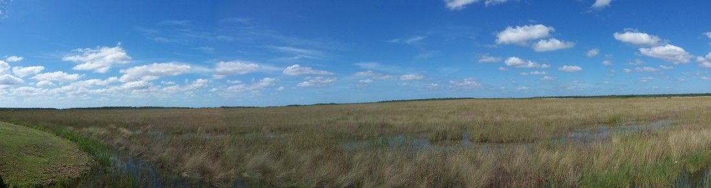
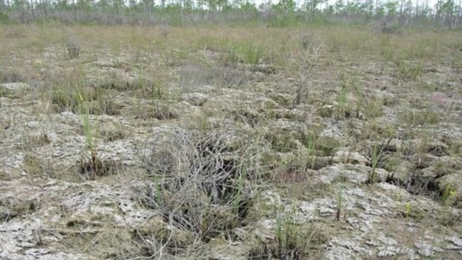

  
  Originally this blog post was originally posted on [Aquatic Thoughts...](https://wetlandbiogeochem.weebly.com/aquatic-thoughts). 

***

```{r 1, out.width="100%",echo=FALSE,fig.align="center"}

```

<br>

**Quick Summary:** Julian P (2017) Assessment of Upper Taylor Slough water quality and implications for ecosystem management in Everglades National Park. Wetlands Ecology and Management 25:191–209.

Taylor Slough (TS) within Everglades National Park (ENP) is a unique portion of the Everglades ecosystem. Taylor slough is the second largest drainage in ENP, a shallow slough flanked by marl prairies, is characterized as a karst ecosystem and has experience variable management throughout its history. Furthermore, biogeochemically TS is an oligotrophic ecosystem with very low concentrations (<10 $\mu g/L$) of total phosphorus (TP). The Everglades ecosystem is predominately a P limiting system therefore any change to the delivery and dynamics of P can result in significant ecological changes. Through the years water management of TS has changed from a sheet-flow to direct discharge back to sheet-flow conditions. Associated changes in water management has also influenced the delivery of nutrients to the slough. As such evaluation of the past water quality and water management can inform and direct future restoration efforts. 

<br>

```{r 2, out.width="50%",echo=FALSE,fig.align="center"}

```

<br>

In short: This paper evaluated hydrologic and biogeochemical dynamics of the upper portion of TS between the S-332 (prior inflow pump station, now decommissioned) to Taylor Slough Bridge (TSB; bridge over Taylor Slough along the Park’s main roadway). Phosphorus dynamics and mineral chemistry was considered.

Why it’s important to science: This paper evaluates management actions, water quality conditions and system dynamics to help explain the occurrence of cattails (Typha spp), an indicator of poor water quality. However, with long term inflow TP concentrations <10 $\mu g/L$ it is hard to argue that the system is being adversely loaded. Furthermore, direct discharge into the slough has been eliminated for several years.

Why it’s important to ecosystem management: Interpretation of eutrophication metrics must be placed in the context of the ecosystem rather than in isolation. With very low inflow water quality conditions encroachment of cattail can’t be unequivocally attributed to inflow water quality but rather historic loading combined with internal system dynamics. Cattail encroachment is a concern because it has the potential to displace sensitive endemic vegetation and alter the biogeochemical continuum of the slough through altering litterfall inputs and redistribution of nutrients within the system. 

Link to publication webpage: [Wetlands Ecology and Management](https://link.springer.com/article/10.1007/s11273-016-9509-8)

_Summary of associated commentary and rebuttal to follow. Stay tuned._

***