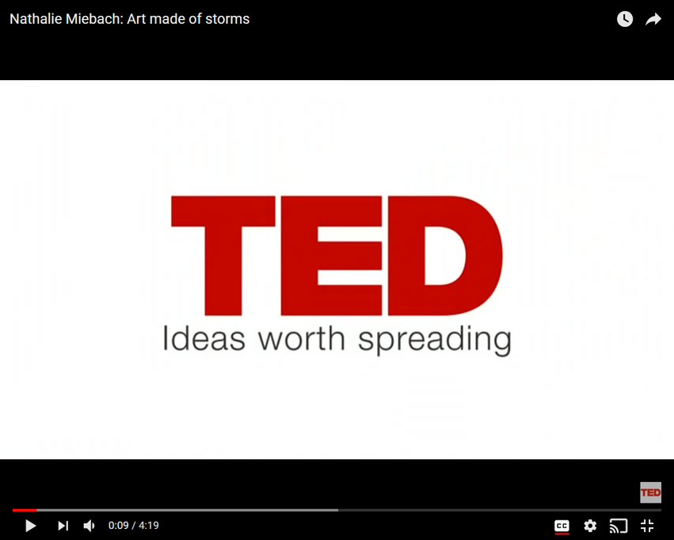
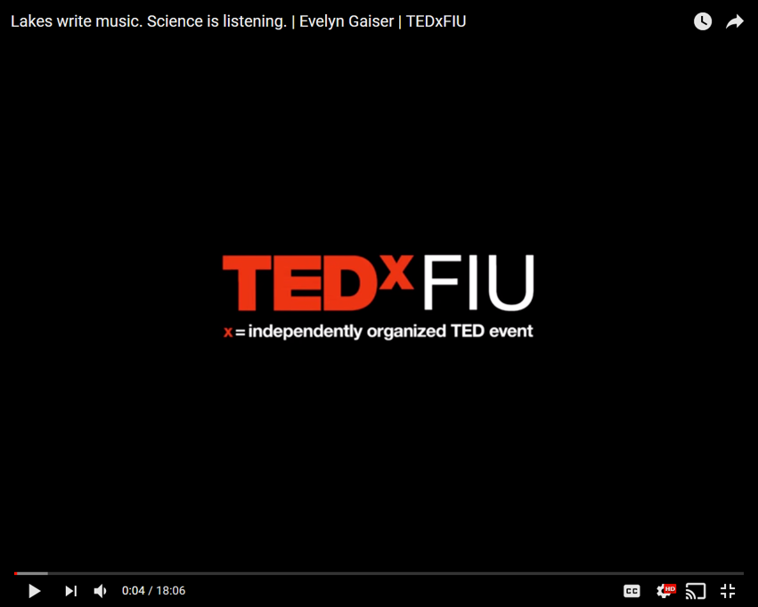
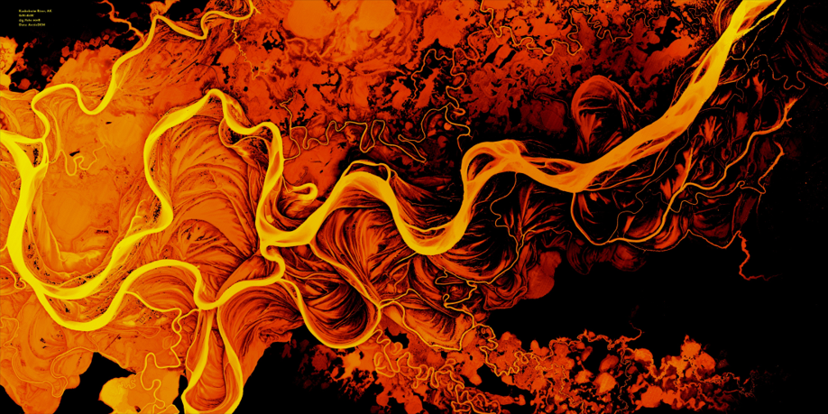

Generally, art has two definitions: 

1. the expression or application of human creative skill and imagination, typically in a visual form such as painting or sculpture, producing works to be appreciated primarily for their beauty or emotional power.
2. the various branches of creative activity, such as painting, music, literature, and dance.

Both definitions focus on two things, creative skill/activity and some medium in which to express this creativity. The classical artistic medium are painting, music, literature or something more physically expressive such as acting or dance (see definition number 2). Art also has the ability to stir emotions as the viewers or participants experience art (see definition number 1). Furthermore, art has evolved from early etchings and simple expression of life to elaborate colorful paintings to large grandiose sculptures and motifs. As this evolution continues more media are added such as photography (late 1800s), cinema, and now digital media such as digital photography and video. The subjects of art have varied between artistis and composers but generally revolve around representing landscapes, people or things. Now it seems that the next frontier of art is to incorporate scientific data in artistically. 

What is [data](https://www.google.com/search?rlz=1C1GCEU_enUS821US821&q=Dictionary#dobs=data)? Simply put data are facts and statistics collected together for reference or analysis. In a computing context data are defined as the quantities, characters, or symbols on which operations are performed by a computer, being stored and transmitted in the form of electrical signals and recorded on magnetic, optical, or mechanical recording media. In a philosophical context data are defined as things known or assumed as facts, making the basis of reasoning or calculation. The use of the word "data" has grown as our ability to collect and analyze facts and statistics have grown, see below. Imagine overlying the _data_ associated with computing power or technological advancement with the plot below, I hypothesize the use of the term data and technological advancement is correlated.   

<div style="text-align: center">
<iframe name="ngram_chart" src="https://books.google.com/ngrams/interactive_chart?year_start=1800&year_end=2008&corpus=15&smoothing=7&case_insensitive=on&content=data&direct_url=t4%3B%2Cdata%3B%2Cc0%3B%2Cs0%3B%3Bdata%3B%2Cc0%3B%3BData%3B%2Cc0%3B%3BDATA%3B%2Cc0" width=700 height=275 marginwidth=0 marginheight=0 hspace=0.5 vspace=0.5 frameborder=0 scrolling=no></iframe>
</div>

<center> Google Books Ngram Viewer for the term "data" between 1800 and 2008. </center>


A recent article by [Jacoba Urist](https://www.theatlantic.com/author/jacoba-urist/) in the Atlantic titled [From Paint to Pixels](https://www.theatlantic.com/entertainment/archive/2015/05/the-rise-of-the-data-artist/392399/) highlights the growing number of artists using scientific data in their creative works and suggests that this expansion of data into art is as much of a product of technological advancement but also a function of the dawn age of _"Big Data"_. This idea of using data in art is nothing new. The concept of programming and data science as an art can be traced back to the founding of computer science as suggested by [Dr Jade Wilson](https://www.elsevier.com/connect/why-data-science-is-an-art-and-how-to-support-the-people-who-do-it#contributors) with his recent [Why data science is an art – and how to support the people who do it](https://www.elsevier.com/connect/why-data-science-is-an-art-and-how-to-support-the-people-who-do-it) article.

The incorporation of scientific data into art is two fold, the first it provides an avenue of outreach. The idea of scientific outreach and education is a natural progression of disseminating science. The idea of sharing our discoveries so that people can understand them is nothing new, think Nicolas Copernicus (developed the model of the universe), Galileo Galilei (father of modern physics), Joseph Priestly (discovered oxygen),  Charles Darwin (father of evolution), and the list goes on and on. The second is the expression of ideas and concepts through the exploration of the natural world. This expression can take the form in many different ways including the most common media such as writing (artistic synonym: literature) and presentation (artistic synonym: acting/dance/story telling). However, more frequently we are telling our scientific stories through other media including music, sculpture, ceramics, fabrics, painting and digital "paintings". Even [interpreative dance](https://www.sciencemag.org/news/2016/10/and-winner-year-s-dance-your-phd-contest) has been used to convey science, most notably through "Dance your Ph.D." by [John Bohannon](https://www.ted.com/speakers/john_bohannon). 

If you plug in science and art into your favorite search engine you will most likely come across a series of Technology, Entertainment and Design (TED) Talks discussing the intersection of art and data. Actually a TED playlist titled [Art made of data](https://www.ted.com/playlists/201/art_from_data) is hosted on [www.ted.com](https://www.ted.com/playlists/201/art_from_data) with the description of:
  
<blockquote> 
    <p> 
    *"Seeing patterns and creating beauty — data visualization has become an art form. Meet pioneering artists who use spreadsheets, archives and digital data as their paints and canvas."*
    </p> 
</blockquote>


The first TED Talk of the playlist is [Nathalie Miebach](http://nathaliemiebach.com/) who transforms data (numbers on a spreadsheet) into complex and elaborate sculptures manifesting the forces of nature and time. In her talk (below) she highlights a sculpture of the interaction of wind speed, temperature and barometric pressure during [Hurricane Noel (2007)](https://en.wikipedia.org/wiki/Hurricane_Noel). This sculpture also is accompanied by a musical score of the data from the [Weather Scores](http://nathaliemiebach.com/weatherscores.html) project. At first glance the sculpture is chaotic but true to artistic observation things begin to become apparent, you begin to see patterns emerge and learn to embrace the complexity of the piece. Yes, through this chaos you begin to understand the interaction of environmental variables which ultimately culminate into what we see as a tropical storm or hurricane. 

<center>
[](https://www.youtube.com/watch?v=MbhNaj88uL4 "Art made of storms - Click to Watch!")
</center>

<center>Art made of storms. | Nathalie Miebach. _Click to watch (it it will redirect to YouTube)_. </center>

This translation of data to art was also done by translating high-frequency lake data into a moving musical compositions. In [Dr Evelyn Gaiser's](https://case.fiu.edu/about/directory/people/gaisere.html) TED Talk (below) she starts by showing a 3D plot of lake temperature at various depths though time with a standard red-to-blue color scale with distinct patterns. This image is artistic in its own right but Dr Gaiser and her students take it to the next level by fitting a muscial scale to the data and we get to hear the song of [Lake Annie](http://www.archbold-station.org/html/research/annie/annie.html). Being an aquatic ecologist, this piece struck me immediately. So much so I had to reach out to Dr Gaiser and thank her for creativity and sharing this amazing piece of art. This performance has personally put [limnology](https://en.wikipedia.org/wiki/Limnology) into a whole different perspective. Dr Gaiser also succinctly stated that “Music seems uniquely suited to expressing the nuances of nature.”    

<center>
[](https://www.youtube.com/watch?v=m7fCmHG3h7k "Lakes write music - Click to Watch!")
</center>

<center>Lakes write music. Science is listening. | Evelyn Gaiser. _Click to watch (it it will redirect to YouTube)_.</center>

"Science art" is not isolated to just sculpture or music, but recently the idea of fusing fashion and art is taking hold. The collaboration between fashion and science is a way to provide a new language for public outreach and science as well as inspiring the Fashion world. The melding of fashion and science goes from elaborate cat walk designs to interesting clothing patterns as is the case for [diatoms on scarfs](https://www.cafepress.com/+diatom+scarves) and other clothing patterns. This movement has even resulted in the birth of a new creative field called [Descience](http://www.thefashionglobe.com/descience), short for design science.

Much like traditional art, "Science art" can vary in size and scope. Some of the most notable and maybe more frequently overlooked is public art displays. Using large public art displays, artist [Xavier Cortada](http://cortada.com) brings our relationship to place, each other and the natural work front and center with large fountains, murals and sculptures to symbolize important species, concepts or phenomenon.    

In addition to music and sculpture we also have digital art. Scientists are no stranger to utilizing technology to collect and analyse data but when you can take this same technology to make art it is truly magical. Early in my career I got acquainted with Geographical Information Systems or GIS where geospatial data (i.e. latitude and longitude) are put together with other attributes (i.e. elevation, water temperature, nutrient concentrations, etc.) and analyzed. In some of these analyses sometimes errors would occur and we would get outputs that look for lack of a better word artistic. Most of us would laugh (or get frustrated) and move on. Errors in data analysis resulting in accidental art is common and you can even find groups on social media like "[accidental aRt](https://twitter.com/accidental__aRt)" displaying some phenomenal pieces of accidental art. Aside from accidental art, intentional art is just as likely. With the advent of high resolution data combined with visualization techniques, like the song of Lake Annie (above), scientific data can be transformed to stunning works of art. One such piece is a "map river art" of Kuskokwim River in Alaska. Using a high resolution digital elevation model (DEM) produced and shared by the [Polar Geospatial Center](https://www.pgc.umn.edu/) the artist (Greg Fiske) artfully put together a piece of braided colors with amazing contrast that I would love to see in a frame. But also serves a great [desktop](https://twitter.com/g_fiske/status/1065016733193420801).  


```{r 0, out.width="75%",echo=FALSE,fig.align="center"}

```
<center>Kuskokwim River, Alaska (USA) by [Greg Fiske](https://twitter.com/g_fiske).</center>

<!---
<blockquote class="twitter-tweet" data-lang="en"><p lang="en" dir="ltr">River art makes a killer desktop background :)   <a href="https://twitter.com/hashtag/map?src=hash&amp;ref_src=twsrc%5Etfw">#map</a> <a href="https://twitter.com/hashtag/river?src=hash&amp;ref_src=twsrc%5Etfw">#river</a> <a href="https://twitter.com/hashtag/art?src=hash&amp;ref_src=twsrc%5Etfw">#art</a> <a href="https://t.co/zEUF3GwOyR">pic.twitter.com/zEUF3GwOyR</a></p>&mdash; Greg Fiske (@g_fiske) <a href="https://twitter.com/g_fiske/status/1065016733193420801?ref_src=twsrc%5Etfw">November 20, 2018</a></blockquote>
<script async src="https://platform.twitter.com/widgets.js" charset="utf-8"></script>
--->

The transformation of this high resolution geospatial data inspired me to start exploring interesting ecosystems. My first attempt was exploring a wetland ecosystem near my home, [Okaloacoochee Slough State Forest](https://www.freshfromflorida.com/Divisions-Offices/Florida-Forest-Service/Our-Forests/State-Forests/Okaloacoochee-Slough-State-Forest). Using geospatial data from the [South Flordia Water Management District](https://www.sfwmd.gov/) I was able to create a motif of greens and yellows with unique shape and texture organized by the nature. This piece represents a valuable and unique freshwater wetland ecosystem situated between upland ecosystems influenced by the encroachment of humans as evidenced by the long linear features (i.e. roads) cutting along the left side and top and nearby agriculture (outside of the frame). In addition to anthropogenic pressure, freshwater wetlands are also sensitive to changes in climate. Wetlands rely on rainfall to hydrate the ecosystem, changes in rainfall patterns and amounts driven by cliamte change can severely impact these ecosystems.

```{r 1, out.width="75%",echo=FALSE,fig.align="center"}
knitr::include_graphics("../images/201812_sciart_post/OKSlough_lidar.png")
```
<center>Okaloacoochee Slough State Forest, Florida (USA).</center>

After my initial attempt, I tried two other regions where suitable data were available. This time I decided to focus on coastal wetland ecosystems. Coastal wetlands are vitally important to adjacent ecosystems by providing essential habitat, flood protection, erosion control, water quality, carbon sequestration and more. To learn more about coastal wetlands follow this [link](https://www.epa.gov/wetlands/coastal-wetlands). These ecosystems are also sensitive to the effects of climate change and possibly more importantly [sea-level rise](https://oceanservice.noaa.gov/facts/sealevel.html). The next two pieces focused on Whitewater Bay of the [coastal Everglades](https://www.nps.gov/ever/index.htm) (Florida) and the [Rowley River](https://en.wikipedia.org/wiki/Rowley_River) in the Plum Island Sound estuary (Massachusetts). While both ecosystems are coastal wetlands, each is affected differently. The Everglades ecosystem in this location very little human activity is notable as much of this is still wild however, sea-level rise is a major threat to this coastal habitat. Meanwhile, the Rowley River has a strong anthropogenic pressure as identified by modified drainage (short light blue linear segments) and sea-level rise are among the major threats. Climate change also affects these ecosystems as they rely on the balance of freshwater in the estuary and saline marine water from the ocean. As noted above climate change can alter rainfall patterns and amounts thereby changing the balance of fresh and saline waters within these estuaries.     

```{r 2, out.width="40%",echo=FALSE,fig.align="center"}
knitr::include_graphics("../images/201812_sciart_post/FCE_Whitewater.png")
```
<center> Whitewater Bay in Everglades National Park, Florida (USA).</center>
<br>

```{r 3, out.width="75%",echo=FALSE,fig.align="center"}
knitr::include_graphics("../images/201812_sciart_post/PlumIsland.png")
```
<center> Rowley River in Plum Island Sound, Massachusetts (USA).</center>

In this age of "**Big Data**" more people, scientist and non-scientists alike are appreciating the beauty and emotional power of scientific data regardless of the medium in which it is displayed. An article in forbes titled ["Why Art And Science Are More Closely Realted Than You Think"](https://www.forbes.com/sites/quora/2016/03/16/why-art-and-science-are-more-closely-related-than-you-think/#20f12ce069f1) summaries it best, _"both science and art are human attempts to understand and describe the world around us."_ But it can equally be used to as a vehicle to raise awareness of the world around us!! 


***

# ***References to artists and writers in this blog is by no means a personal endorsement of the artisits, authors or publishers. Reference $\neq$ endorse.***

File complied `r format(Sys.time(),"%F %X %Z")`