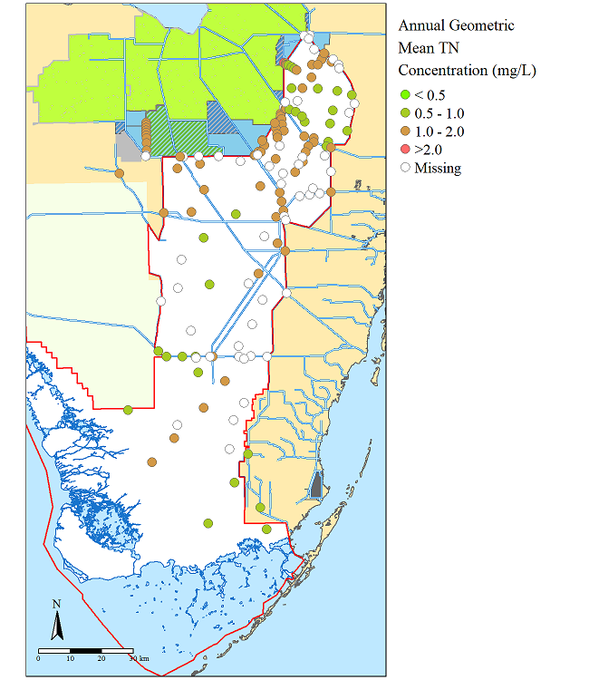
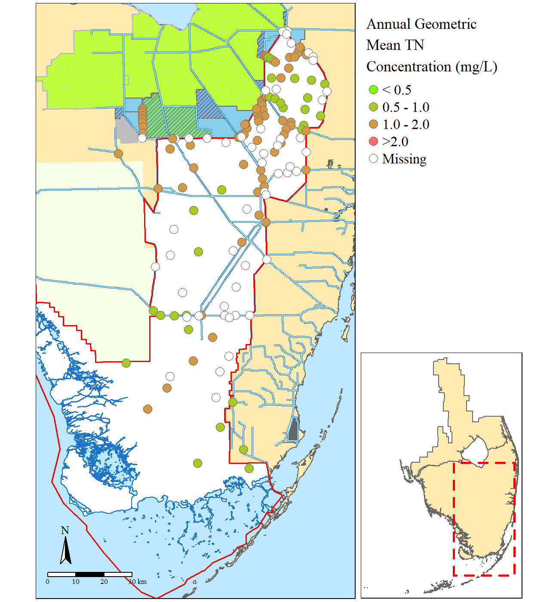

__Keywords:__ tmap, rstats, R, GIS

***

This post was originally hosted on at my  [rstat_mapping](https://github.com/SwampThingPaul/rstat_mapping) GitHub repository. Where an example geodatabase with geospatial data, summary statistis (i.e. site specific annual mean total nitrogen concentration) and associated #rstats code is housed. 

_This post is slightly edited from the original post in the GitHub repo_

***

# Basic Mapping In R

To date mapping in R has been very limited and frustrating. As many people have noted that R is not a mapping software. Its not really a geospatial analysis software however with the develope of more and more packages and the evolution of R it is quickly becoming a tool to conduct geospatial statistics and analysis. Regardless the first step in GIS is typically to produce a map.

[This repository](https://github.com/SwampThingPaul/rstat_mapping) houses a geospatial database (.gdb) assembled in ArcGIS, several comma-seperated files (.csv) and a basic R script developed for this repositiory to develop the map below.

```{r 1, out.width="75%",echo=FALSE,fig.align="center"}

```
<center> Map of annual mean total nitrogen concentrations from sites within the Everglades Protection Area (Southern Florida).</center>


The R-script utilizes several packages including `library(tmap)` [github page](https://github.com/mtennekes/tmap) and `library(HatchedPolygons)` [github page](https://github.com/statnmap/HatchedPolygons). 

Here is a list of libraries called for this effort (some may not be used).
```
library(maptools)
library(classInt)
library(GISTools)
library(rgdal)
library(sp)
library(tmap)
library(raster)
library(spatstat)
library(sf)
library(HatchedPolygons)

library(plyr)
```

Unfortunatly at this time, the `tmap` library does not have a pattern filled option for polygons as discussed [here](https://github.com/mtennekes/tmap/issues/49). Therefore a workaround is needed, leveraging the functions in the `HatchedPolygons` library, I developed a custom helper function to make a patterned fill. The motivation of the custom function is that the `hatched.SpatialPolygons()` function does not produce a spatial data frame with a projection, therefore I added the `proj4string()` function into the custom function.  

```
hatched.SP=function(x,density=0.001,angle=45,fillOddEven = FALSE){
  require(HatchedPolygons)
  tmp=hatched.SpatialPolygons(x,density=density,angle=angle,fillOddEven = fillOddEven)
  proj4string(tmp)=proj4string(x)
  return(tmp)
}
```

****

Since the original post/development of the GitHub repo another workaround has been developed [link](https://github.com/mtennekes/tmap/issues/49#issuecomment-448692646). __Caveat:__ I have not tried this alternative workaround.

****

So far after endless hours of searching I found the `tmap` library, so far the easiest I have explored for producing reproducible maps in the R-environment beyond the base package (which is equally a viable option as well). After importing and adjusting data as needed a basemap can be put together very easily using the `tmap` functionality. After setting your bounding box or "Area of Interest" you are off to the races specifying where the layers sit (like in ArcGIS), what color, line type, point type, etc. Below is from the r-script ([link](https://github.com/SwampThingPaul/rstat_mapping/blob/6cb5b478149678830c7e9d5e09de66918623ce94/X_rstat_map.R)), some layers are called twice for effect. 


```
bbox=raster::extent(473714,587635,2748300,2960854);#Bounding box for our Area of Interest (AOI)
base.map=tm_shape(shore,bbox=bbox)+tm_polygons(col=cols[1])+
  tm_shape(eaa)+tm_fill("olivedrab1")+tm_borders("grey",lwd=1.5,lty=1.75)+
  tm_shape(spsample(eaa,"random",n=500,pretty=F))+tm_dots(col="grey80",size=0.005)+
  tm_shape(c139)+tm_fill("grey")+
  tm_shape(sta)+tm_polygons("skyblue")+
  tm_shape(rs.feat)+tm_polygons("steelblue3")+
  tm_shape(rs.feat.hatch)+tm_lines(col="grey")+
  tm_shape(wma)+tm_borders("grey50",lwd=1.5,lty=2)+tm_fill(cols[3])+
  tm_shape(wma.hatch)+tm_lines(col=cols[5],lwd=2)+tm_shape(wma)+tm_borders("grey50",lwd=2,lty=1)+
  tm_shape(wca)+tm_fill("white")+
  tm_shape(bcnp)+tm_fill(cols[4])+
  tm_shape(enp.shore)+tm_fill("white")+tm_borders("dodgerblue3",lwd=1)+
  tm_shape(canal)+tm_lines("dodgerblue3",lwd=2)+
  tm_shape(canal)+tm_lines(cols[2],lwd=1)+
  tm_shape(evpa)+tm_borders(col="red",lwd=1.5);
```

Once the base map is put together to your liking, then you can layer on points, rasters, etc. very simply. 

```
base.map+tm_shape(TN.GM)+tm_symbol();
```
Use the `png() ... dev.off()` function to write the plot to a file or use the `tmap_save()` function. 

A complete script has been posted in this repository for your convience named [X_rstat_map.r](https://github.com/SwampThingPaul/rstat_mapping/blob/6cb5b478149678830c7e9d5e09de66918623ce94/X_rstat_map.R). 


# Adding inset maps

Adding an inset or regional map is sometime the go-to thing, expecially for ecological studies. This helps put the study in a regional or national context and orient people to your study area. 

Using the exsisting [code](https://github.com/SwampThingPaul/rstat_mapping/blob/f64c19d9c00d66986d969b4c7d2e02c9c88407fe/X_rstat_map.R) and data posted in this repository in conjunction with `Viewport()` in the `library(grid)` or `tmap_save()`.

```{r 2, out.width="75%",echo=FALSE,fig.align="center"}

```
<center> Map of annual mean total nitrogen concentrations from sites within the Everglades Protection Area (Southern Florida) with an regional map identifying the area of interest.</center>

__Focused study site map.__
```
map2=base.map+tm_shape(TN.GM)+
  tm_symbols(size=0.5,col="Geomean",breaks=c(-Inf,0.5,1,2,Inf),showNA=T,palette=cols.rmp,
             title.col="Annual Geometric \nMean TN \nConcentration (mg/L)",
             labels=c("\u003C 0.5","0.5 - 1.0","1.0 - 2.0", "\u003E2.0"),
             border.lwd=0.5,colorNA = "white")+
  tm_compass(type="arrow",position=c("left","bottom"))+
  tm_scale_bar(position=c("left","bottom"))+
  tm_layout(bg.color=cols[2],fontfamily = "serif",legend.outside=T,scale=1,asp=NA,
            outer.margins=c(0.005,0.01,0.005,0.01),inner.margins = 0,between.margin=0,
            legend.text.size=1,legend.title.size=1.25)
```

Essentially a second regional map is needed for the inset and adding a polygon showing the extent of the larger map. To make the larger map extent polygon you can leverage the `bbox` of the larger map.

```
bbox.poly=as(bbox,"SpatialPolygons")#makes the polygon
proj4string(bbox.poly)=proj4string(evpa)#projects the polygon

#the smaller basic regional map
region.map=tm_shape(shore)+tm_polygons(col=cols[1])+
  tm_shape(bbox.poly)+tm_borders(lty=2,lwd=2.5,"red")
```

To view and see how things fits together you can use the `Viewport()` function, granted its tricky to move things around since the units Normalised Parent Coordinates"npc".

```
map2
print(region.map,vp=viewport(0.82,0.29,0.3,0.60,just="right"))
```

Once you are happy with the results, you need to use the `tmap_save()` function to write the map to a file.  

```
tmap_save(map2,"example.png",width = 6.5,height=7,units="in",dpi=200,
  insets_tm=region.map,insets_vp =viewport(0.94,0.21,0.3,0.60,just="right") )
```
***

Happy Mapping

```{r 3, out.width="25%",echo=FALSE,fig.align="center",fig.cap="image from [source](https://fra.me/gis)"}

```

***