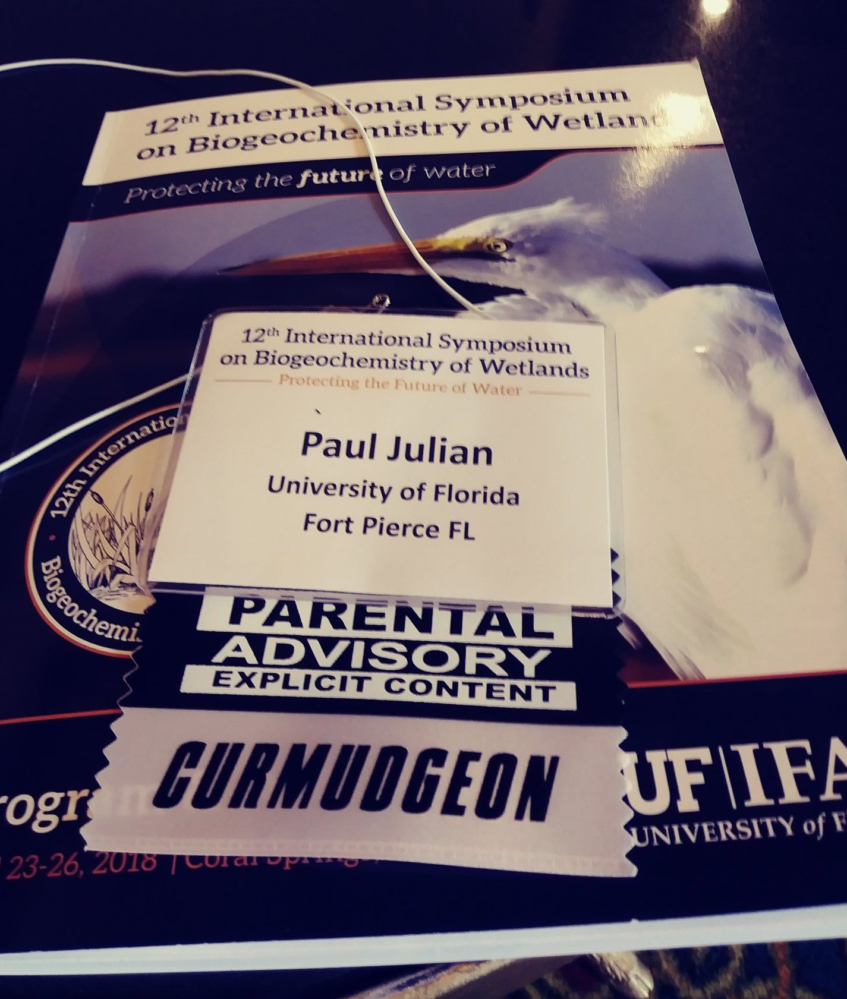

__Keywords:__ imposer syndrome, social media, mental health, work-life balance.

***

Before the start to the New Year I decided that a break from social media (i.e. Twitter) will do me some good in an attempt to give me a refresh. 

```{r 0, out.width="50%",echo=FALSE,fig.align="center",fig.cap="[See Paul Julian, PhD's other Tweets](https://twitter.com/SwampThingPaul)"}

```


Originally I was going to write a thread on twitter upon my return but the thread turned into a saga...so I decide to put it together as a blog post. While not overly long, this is my initial thoughts upon my reflection...which reminds me of a quote from a great movie that has stuck with me throughout the years. I indeed am on a rigid search and am beginning to see everything illuminated in the light of the past.  

```{r 1, out.width="50%",echo=FALSE,fig.align="center"}

```


This week I took a slight hiatus from twitter in an effort to help me focus, reflect and realign. Overall the break was good, the first couple of days I felt like I was missing out...guess what? I wasn't missing anything really but am quickly getting up to speed on posts from colleagues and friends. The world didn't end because I didn't check my twitter, who would have imagined. I think to some degree we get trapped in our digital world because we work and play so much in digital space now a days that it tough to break away. During this break my wife and I did some hiking which was a great respite to all the craziness in the world and in my head. We explored the wild Florida scrub of [Bob Janes Preserve](http://www.leegov.com/conservation2020/preserves/preserve?projid=8) and amazingly peaceful wet Cypress and Pond Apple domes of [Big Cypress National Preserve](https://www.nps.gov/bicy/index.htm).

```{r 2, out.width="75%",echo=FALSE,fig.align="center"}

```

```{r 3, out.width="75%",echo=FALSE,fig.align="center"}

```

During my reflection, I realized among some I have a particular reputation. Some find me grumpy and crass (not afraid of dropping the f-bomb...after all I did get a "Parental Advisory" and "Curmudgeon"" badge at a conference...see below"), some find me as a troublemaker (boat rocker), some see me as a crazy hippy, some see a jock (yes, I play collegiate sports), some see a goof-ball and some find me sharing and open. Maybe these are all my different personalities but its all me. 

```{r 4, out.width="50%",echo=FALSE,fig.align="center"}

```

Personally, In my professional life I feel that my reputation is one that challenges the status quo, am always willing to ask why, stand up for good science and be respectful. My goal is to  progress forward but be willing to look back occasionally, after all I frequently revisit landmark papers in my field. 

I guess depending on which side of the issues you are on you would see my different personalities. This came to a head a couple years back when a professor I respected and looked up to from one of my alma mater (starting with F ending in Gulf Coast😉) pulled me aside at a conference and began to berate me about some of my recent publications. These publications essentially went back to the data and re-evaluated the current hypotheses and paradigms, letting the data do the talking. It perfectly open to discussion and debate, this was neither. This event happened early in my PhD program...talk about disheartening but I moved ahead regardless. Luckily I my PhD did not focus on the same topic. 

During my PhD program, as may do I had to handle egos and issues both internal and external to the program. The cumulative stress of working full time, pursuing a degree part-time, conducting research, presenting at conferences, publishing and handling all the grad-school drama (and personal things) didn't help my [impostor syndrome](https://en.wikipedia.org/wiki/Impostor_syndrome) any...matter of fact it made it worst. To some degree joining the Twitter community help me form a great support network where I got to (and continue) connect with some great people (you know who you are) that helped me through some really tough times. But the downside to social media is that it also contributed to the constant struggle with the impostor syndrome demon.

Another reason for the hiatus and my pull back from social media was to help me reign in the hopeless feeling of inadequacy. In a recent discussion with a friend, we lamented about being "newly minted" PhD's and how it is so easy to compare ourselves to the rest of the scientific community for good and bad. This helped put things into perspective...as a new PhD we shouldn't compare ourselves to those who have been at the academia (or industry) for several years but rather aspire. Unfortunately, for me personally aspire quickly gets replaced by compare, and the light of the past beginnings to shine (in a bad way) and the impostor demon rears its ugly head.   

In my mind respect is huge!! Personally, the first time I meet/communicate with someone they start at an equal starting point (regardless of what I hear otherwise) and it's up to them to gain or lose my respect. Overall I am an open, caring and giving person but don't disrespect me, I don't have time for that...nobody has time for that. I like the old adage "Can't we all get along?"...there really is no need to berate a student, denigrate a fellow researcher, or belittle each other. 

One great thing about social media and my amazing Twitter network is I get to keep tabs on my friends or colleagues. Not in a weird stalky kind of way... In my mind if one of my friends or colleagues succeed I feel like I also succeed, especially if I helped in anyway which is why I am always willing to lend a hand. If I can help and contribute I will. Like many I and some see this as a problem is I am always willing to say "Yes", granted this gets me in trouble with time management at times but I manage. There are countless articles online on how to start saying "No". The same is true about failures...after the initial impact, I try (its hard) to evaluate why as a learning experience.

I am sure this is "Too Much Information"" and not as enlightening for you as it was for me...but I wanted to share some my accumulation of thoughts over the last week. I hope that everyone has a great start to the new year (even though its just another day). 

***