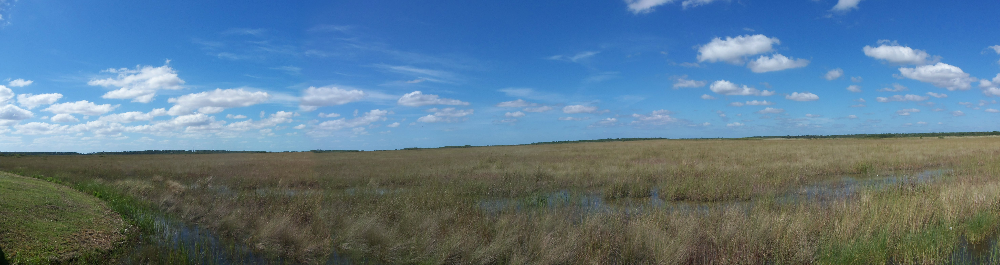
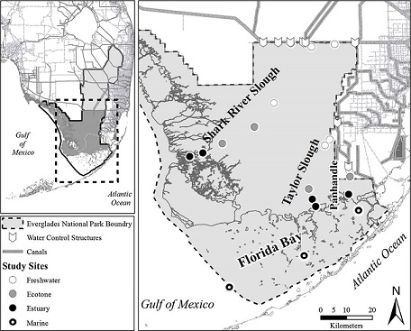
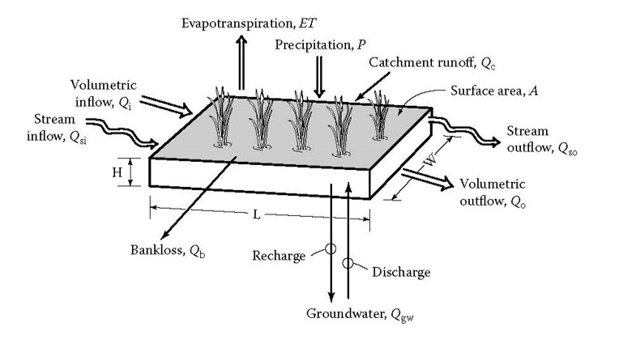

```{r libraries,echo=FALSE,message=FALSE,warning=F}
library(plyr)
library(reshape)
library(zoo)
library(HURDAT)

#GIS libraries
library(rgdal)
library(rgeos)
library(sp)
library(sf)
library(tmap)
library(tmaptools)

source("D:/Commonlyusedfunctions.r")

wdpath="D:/UF/LTER/Projects/System Dynamics"
data.path=paste0(wdpath,"/Data")
export.path=paste0(wdpath,"/Export")
GIS.path="D:/_GISData"


nad83.pro=CRS("+init=epsg:4269")
utm17=CRS("+proj=utm +zone=17 +ellps=GRS80 +towgs84=0,0,0,0,0,0,0 +units=m +no_defs")

knitr::opts_chunk$set(fig.align = "center")

```


```{r, out.width="80%",echo=FALSE,fig.cap="The view from Taylor Slough bridge along the main park road."}

```

Management of aquatic ecosystem and large-scale (watershed) restoration efforts are complex and dynamic processes that at times go at odds to each other. Classic ideas of ecosystem management often involves maintaining the system within a historically relevant range of variability of abiotic and biotic drivers (Seastedt et al. 2008). However, at times this approach of historic variability conflict with current ecosystem configuration and requirements combined with anthropogenic needs such as flood protection and water supply (Gunderson and Light 2006).  Given this conflict of human needs seem to challenge the capacity of desired ecosystem states to cope with extreme events and disturbances ultimately testing the ecosystems resilience.  The objective of this post is to walk through some of the external processes and pressures that can influence the internal systems ecology of an ecosystem in both the short and long-term.


## Study Area


The Florida Coastal Everglades Long Term Ecological Research site ([FCE LTER](http://fcelter.fiu.edu/){target="_blank"}) is part of the [LTER](https://lternet.edu/){target="_blank"} network comprised of approximately three dozen sites established to study long term changes in a variety of ecosystems. The FCE LTER site  focuses on the interaction between freshwater and estuarine ecosystems with respect to  hydrology, climate, and human activities that affect ecosystem and population dynamics in the ecotone and more broadly, the FCE. FCE is located within Everglades National Park ([ENP](https://www.nps.gov/ever/index.htm){target="_blank"}) composed of a series of long-term monitoring location to understand long term changes in the Everglades ecosystem. 

Everglades National Park is located at the southern-most extent of the Everglades Protection Area and receives surface water from Water Conservation Area 3A and Big Cypress National Preserve (Osborne et al. 2011). Everglades National Park has two major drainage, Shark River Slough (SRS) and Taylor Slough (TS). Shark River Slough is the major water flow-pathway through ENP, and is approximately 32 kilometer (km) wide along the northern border, narrowing to approximately 10 km near its discharge point at the Gulf of Mexico (GoM). This area has relatively low elevation and maintains a long hydroperiod facilitating the accretion of organic matter (Bazante et al. 2006, Osborne et al. 2011). TS is the second largest water flow path through the southeastern portion of the ENP. Upper reaches of TS are narrow, elevations are relatively high, the hydroperiod is relatively short, and soils are relatively low in organic matter. The Panhandle (Ph) portion of the ENP is located adjacent to TS, characterized as a marl prairie with shallow carbonate soils. The primary source of surface water to the Ph region is from the C-111 canal during the wet season, and thus this region experiences a very short hydroperiod (Ross et al. 2000).

Vegetation and ecosystem characteristics in ENP vary along a salinity gradient. The freshwater landscapes within ENP are dominated by a ridge and slough topography interspersed with sawgrass marshes and tree islands. Ecotone regions grade from freshwater to brackish environments and are characterized by oligohaline, mixed marsh/mangrove forests. Farther downstream in more saline water are fringing mangroves. Finally, Florida Bay receives seawater from the GoM and a small volume of freshwater runoff from ENP and is characterized as a seagrass-dominated marine environment (Chambers and Pederson 2006, Childers 2006). 

```{r, out.width="50%",echo=FALSE,fig.cap="Map of the study area with monitoring locations and ecosystems identified from stations within the Florida Coastal Everglades Long Term Ecological Research network in Everglades National Park"}

```

## External Drivers

### Water Management 

Due to ecosystem manipulations starting in the later 1800s/ early 1900s the entire Everglades ecosystem is a managed system where the quantity, timing and distribution is strictly managed. Eventually this water management system would be call the  ([C&SF Project](https://www.saj.usace.army.mil/CFS-CSFC/){target="_blank"}). The intent of the C&SF Project was multi-purpose project that provides flood control; water supply for municipal, industrial, and agricultural uses; prevention of saltwater intrusion; water supply for the ENP; and protection of fish and wildlife resources.  Management of this water falls broadly under the umbrellas of flood protection, consumptive use (i.e. drinking and irrigation water) and ecological. 

Much of the water deliver to SRS originates in WCA-3 to the north via the L67A and C canals and/or through the WCA-3 marsh. The S12s (A - D) located on the Tamiami Trail allow water from WCA-3 to flow into northwest SRS. While operation of the S-333 and S-334 provide limited flows the eastern portion of the Tamiami canal (L-29) where water flows through a series of culvert and bridges into northeastern SRS. Historically the majority of the water entered SRS in the eastern portion of the slough, however due to construction of the C&SF project this flow was shifted to the west. Future restoration efforts are aiming to re-establish this historic flow patterns by changing water management and restoration activities. 

Water entering TS and the Ph regions of ENP are delivered through the South Dade Conveyance System (SDCS), a modification to the original C&SF Project. The primary purpose of the SDCS was to provide irrigation water to agricultural operations in south Miami-Dade county, provide flood protection and meet the Congressionally mandated minimum water deliveries to TS. To achieve this a series of canals, water control structures and impoundments were constructed. 

Throughout the years, water management has changed across ENP and the FCE for various reasons involving balancing the ecological health of the ecosystem and flood protection needs of communities around ENP.  

* **Experimental Water Deliveries:** goal of the experimental program was to modify the schedule for delivery of water to ENP and conduct experimental deliveries for the purpose of determining an improved schedule of water deliveries. Much of the ecological and hydrological information existing prior to the program indicated a need to reestablish historic flow patterns within the entire Shark Slough drainage basin.

* **Interim Strutural and Operational Plan (ISOP):** Developed in response to concerns of potential flooding of communities along the eastern Everglades.

* **Interim Operational Plan (IOP):** Developed to create favorable hydroperiods in Cape Sable Seaside Sparrow ([CSSS](https://www.nps.gov/ever/learn/nature/csss.htm){target="_blank"}) habitat within ENP while providing flood protection capability for developed lands east of the L-31N Canal.

* **Everglades Restoration Transition Plan ([ERTP](https://www.saj.usace.army.mil/Missions/Environmental/Ecosystem-Restoration/Everglades-Restoration-Transition-Plan-ERTP/){target="_blank"}):** Operational plan that establishes how federal water control structures are operated in the southern portion of the Everglades system to meet responsibilities for flood control and to minimize adverse effects to threatened and endangered species. This plan provides greater flexibility to store and release water in Water Conservation Area-3A, and as a result increases operational flexibility in the system and improves conditions for multiple species inhabiting the area. [link](https://www.saj.usace.army.mil/Missions/Environmental/Ecosystem-Restoration/Everglades-Restoration-Transition-Plan-ERTP/){target="_blank"}

* **Modified Waters Deliveries Incremental Testing:** an incremental field test that will be used to evaluate how additional water will ultimately be sent south to Everglades National Park through the Modified Water Deliveries (Mod Waters) and C-111 South Dade projects.

* **Emergency Deviations in Operations:** Historic amounts of rainfall required a drastic adaptive change in water management in response to unprecedented water levels and rainfall volumes throughout the Everglades Ecosystem. [Link to additional information](https://apps.sfwmd.gov/sfwmd/SFER/2017_sfer_final/v1/chapters/v1_ch2.pdf){target="_blank"}

* **Combined Operational Plan ([COP](https://www.saj.usace.army.mil/Portals/44/docs/Environmental/C-111%20South%20Dade/SouthernEvergladesOverview_web.pdf){target="_blank"}):** Comprehensive integrated water control plan for WCA-3A, ENP and SDCS. The plan will help to achieve optimal restoration and operational benefits for the southern Everglades ecosystem, and will be implemented once all necessary infrastructure is in place. 

### Water Quality Improvements

In the mod 1900s environmental and scientific communities began growing concern over the deterioration of the Everglades ecosystem through extensive hydrological modification (introduced above) and the resulting loss of biotic integrity threatening the remaining ecosystem. By the late 1990s, the state of Florida began passing legislation aimed at protecting the Florida Everglades through the **Everglades Protection Act** later this legislation evolved into the [Everglades Forever Act](https://floridadep.gov/eco-pro/eco-pro/content/everglades-forever-act-efa){target="_blank"} and [Restoration Strategies ](https://www.sfwmd.gov/our-work/restoration-strategies){target="_blank"}.

As part of the Everglades Protection Act, the state of Florida initiated design of a storm water management system intended to improve water quality entering the Everglades ecosystem and by 1994 the Everglades Nutrient Removal Project (ENR) was operational. Eventually additional storm water treatment areas (STAs) were to the current configuration of five-storm water STAs achieving a total of 2.3 x 10^6^ kilograms (kg) of phosphorus (circa April 2017). Initiated with the construction of the ENR, coverage of STAs have steadily increased to 230 km^2^ of submerged and emergent aquatic vegetation treatment wetlands (Chimney 2018). In addition to STA coverage, flow-equalization basins (FEBs) are also being utilized to store and attenuate water to the STAs during period of low water (i.e. dry season). A total of three-FEBs are planned, two of which are completed and in operation. Both the A-1 (constructed and operational) and C-139 (planned, completion by 2023) FEB utilize shallow surface water storage where vegetation will opportunistically remove phosphorus from the water column prior to delivering water to the STAs. The A-1 FEB is capable of storing 7.4 x 10^7^ m^3^ (60,000 acre-feet) through 60 km^3^ of aboveground storage for STA-2 and 3/4 while the C-139 FEB is expected to provide 1.4 x 10^7^ m^3^ (11,000 acre-feet) of aboveground storage for flows to STA 5/6 (South Florida Water Management District 2012; Laham-Pass 2017). Meanwhile the L-8 FEB utilizes deep surface water storage to store 5.5 x 10^7^ m^3^ (45,000 acre-feet; Xue 2017) to attenuate flows to STA-1W and 1E. Additional storage in the regional is expected with upcoming state and federal authorization, how it will relate to STA operations is currently unknown. 


```{r STAarea,echo=FALSE,message=FALSE,warning=F}
STA.area=read.csv("D:/UF/LTER/Projects/System Dynamics/Data/STA_area_sum.csv")
area.sum=ddply(STA.area,"Cyr",summarise,TArea=sum(Area_km2,na.rm=T))
area.sum$cum.sum.area=cumsum(area.sum$TArea)
```


```{r STAarea_plot,fig.height=3.5,fig.width=6,echo=FALSE}
par(family="serif",mar=c(0.5,1.5,1,0.75),oma=c(3,3,0.25,0.25),mgp=c(3,1,0));
xlim.val=c(1994,2026);by.x=8;xmaj=seq(xlim.val[1],xlim.val[2],by.x);xmin=seq(xlim.val[1],xlim.val[2],by.x/by.x)
ylim.val=c(0,400);by.y=100;ymaj=seq(ylim.val[1],ylim.val[2],by.y);ymin=seq(ylim.val[1],ylim.val[2],by.y/2)

plot(cum.sum.area~Cyr,area.sum,type="n",ylim=ylim.val,xlim=xlim.val,yaxt="n",xaxt="n",ylab=NA,xlab=NA)
abline(v=xmaj,h=ymaj,lty=3,col="grey")
with(area.sum,points(Cyr,cum.sum.area,pch=19,col="grey",cex=2))
k=with(area.sum,lowess(Cyr,cum.sum.area))
lines(k$x,k$y,lwd=2,col="black")
axis_fun(1,xmaj,xmin,xmaj,1)
axis_fun(2,ymaj,ymin,ymaj,1)
abline(v=format(Sys.Date(),"%Y"),lwd=2,lty=2)
mtext(side=1,line=2,"Calendar Year")
mtext(side=2,line=3.35,expression(paste("Cummulative",sep="")))
mtext(side=2,line=2.25,"STA and FEB Area (km\u00b2 )")

```
<center>Current and expected (estimated) cumulative stormwater treatment area (STA) and flow-equalization basin (FEB) coverage with the Everglades ecosystem. Actual cumulative annual areal extent of STA and FEB coverage identified by grey points. Dashed vertical line indicates to current.</center>

### Natural Disturbances

Hurricanes, floods (high water) and droughts can wreak havoc on society and nature alike. In South Florida these large scale disturbance events are expected and occur frequently as such our ecosystems have adapted to these extremes and are typically resilient to there effects. 

#### Hurricanes 

Using data from the National Oceanic and Atmospheric Administration ([NOAA](https://www.noaa.gov/){target="_blank"}) the occurrence of hurricanes within 200 km of ENP is frequent. This frequency of return and intensity can play a significant role in how ecosystems within the Everglades region function. 

```{r hurricane,include=FALSE,warning=FALSE,message=FALSE,echo=FALSE}
hur.tck=readOGR(export.path,"hurricane_ln2")
hur.tck=spTransform(hur.tck,utm17)

enp=readOGR(paste0(GIS.path,"/SFER_GIS_Geodatabase.gdb"),"ENP")
enp.buffer=gBuffer(enp,width=200*1000)
enp.buffer=SpatialPolygonsDataFrame(enp.buffer,data.frame(row.names = "buffer",width.km=200,area="ENP"))

enp.hurr=over(enp.buffer,hur.tck,returnList = T,byid=T)[[1]]
enp.hurr=enp.hurr[order(enp.hurr$WY_start,enp.hurr$Key),]

hurr.N.enp=ddply(enp.hurr,c("WY_start"),summarise,N.val=N(Key))
hur.tck2=subset(hur.tck,Key%in%enp.hurr$Key)

#plot(N.val~WY_start,hurr.N.enp)
hurr.N.enp=merge(hurr.N.enp,data.frame(WY_start=seq(1851,2017,1),fill=1),"WY_start",all.y=T)
hurr.N.enp$N.val=with(hurr.N.enp,ifelse(is.na(N.val),0,N.val))
#plot(N.val~WY_start,hurr.N.enp,type="l")

All_Hurricanes=hur.tck
ENP_Hurricanes_25km=hur.tck2
map=tm_shape(enp)+tm_polygons(col="dodgerblue1",alpha=0.2)+
  tm_shape(All_Hurricanes)+tm_lines(col="black",lty=2,lwd=1.5,alpha=0.4)+
  tm_shape(ENP_Hurricanes_25km)+tm_lines(col="indianred2",lwd=3,alpha=0.5)+
  tm_add_legend(type="fill",label="All Hurricanes/Tropical Storms (1851 - 2017)",col="grey")+
  tm_add_legend(type="fill",label="Storms within 25 km of ENP (1851 - 2017)",col="indianred2")


```

```{r hurricane_map,echo=FALSE,out.width="100%",fig.cap="Atlantic Basin Hurricane and Tropical Storm center lines."}
tmap_leaflet(map)
```

```{r hurricane_freq,fig.height=3.5,fig.width=6,echo=FALSE,fig.cap="Frequency of Tropical Storms or Hurricanes that pass within 200 km of ENP. Based on Florida Water Year (May 1^st^ to Apirl 30^th^)."}
par(family="serif",mar=c(1,1.5,1,0.75),oma=c(2,3,0.25,0.25),mgp=c(3,1,0));
xlim.val=c(1850,2017);by.x=20;xmaj=seq(xlim.val[1],xlim.val[2],by.x);xmin=seq(xlim.val[1],xlim.val[2],by.x/by.x)
ylim.val=c(0,5);by.y=1;ymaj=seq(ylim.val[1],ylim.val[2],by.y);ymin=seq(ylim.val[1],ylim.val[2],by.y/by.y)

plot(N.val~WY_start,hurr.N.enp,type="n",ylim=ylim.val,xlim=xlim.val,yaxt="n",xaxt="n",ylab=NA,xlab=NA)
abline(v=xmaj,h=ymaj,lty=3,col="grey")
with(hurr.N.enp,lines(WY_start,N.val,col="dodgerblue1",lwd=1.25))
axis_fun(1,xmaj,xmin,xmaj,1)
axis_fun(2,ymaj,ymin,ymaj,1);box(lwd=1)
mtext(side=1,line=1.5,"Florida Water Year")
mtext(side=2,line=2,"Number of Storms per year")

```

#### High Water/Flood

Given the highly managed nature of the Everglades ecosystem combined with the high annual rainfall and subtropical climate the Everglades ecosystem can experience periods of prolonged flooding/high water. High water events are not only detrimental to the ecology of the ecosystem but also poses significant to humans in the area with respect to flood protection. Water levels within the Everglades ecosystem can be highly dynamics and seasonal, responding to inputs (i.e. rainfall, inflow surface water discharge, etc.) and outputs (i.e. evapotranspiration and outflow surface water discharge, seepage, etc.).


```{r, out.width="80%",echo=FALSE,fig.cap="Typical wetland water budget from Kadlec and Wallace (2009)."}

```


```{r WL_data,include=FALSE,warning=FALSE,message=FALSE,echo=FALSE}
dates=as.Date(c("1992-05-01","2017-05-01"))
wca3.stg=data.frame()
dbkey.list.stg=data.frame(SITE=c("CA362","CA363"),DBKEY=c("16536","16532"))
pb=txtProgressBar(1,max=length(dbkey.list.stg$DBKEY),style=3)
for(i in 1:length(dbkey.list.stg$DBKEY)){
  tmp=SFWMD.DBHYDRO.Data.daily(dates[1],dates[2],dbkey.list.stg$DBKEY[i])
  wca3.stg=rbind(tmp,wca3.stg)
  setTxtProgressBar(pb,i)
}

wca3.stg=merge(wca3.stg,dbkey.list.stg,"DBKEY")
wca3.stg$FLWY=FLWY(wca3.stg$Date)
wca3.stg$Date.EST=date.fun(wca3.stg$Date)

stgdata.xtab=cast(wca3.stg,Date.EST+FLWY~SITE,value="Data.Value",mean)
stgdata.xtab$Mean.6263=rowMeans(stgdata.xtab[,c("CA362","CA363")],na.rm=T)
stgdata.xtab$rec.close=(stgdata.xtab$Mean.6263>11.6)*1
stgdata.xtab$rollsum.rec.close=with(stgdata.xtab,rollsum(rec.close,60,na.pad=T))
stgdata.xtab$high.water=with(stgdata.xtab,ifelse(rollsum.rec.close==60,1,0))

HW_years=ddply(stgdata.xtab,"FLWY",summarise,N.HW=sum(high.water,na.rm=T),days.above=sum(rec.close,na.rm=T),per.days.above=(sum(rec.close,na.rm=T)/N(Mean.6263))*100)

#plot(Mean.6263~Date.EST,stgdata.xtab)

```


```{r WL_plot,fig.height=4,fig.width=6,echo=FALSE,fig.cap="Daily water level of northern WCA-3A (CA3-62 and CA3-63 sites) used to indicate high water conditions."}
par(family="serif",mar=c(0.5,1.5,1,0.75),oma=c(1.5,3,0.25,0.25),mgp=c(3,1,0));
xlim.val=date.fun(dates);xmaj=seq(xlim.val[1],xlim.val[2],"5 years");xmin=seq(xlim.val[1],xlim.val[2],"1 years")
ylim.val=c(8,14);by.y=2;ymaj=seq(ylim.val[1],ylim.val[2],by.y);ymin=seq(ylim.val[1],ylim.val[2],by.y/by.y)

plot(Mean.6263~Date.EST,stgdata.xtab,type="n",ylim=ylim.val,xlim=xlim.val,yaxt="n",xaxt="n",ylab=NA,xlab=NA)
abline(v=xmaj,h=ymaj,lty=3,col="grey")
with(stgdata.xtab,lines(Date.EST,Mean.6263,col="dodgerblue1",lwd=1.25))
axis_fun(1,xmaj,xmin,format(xmaj,"%m-%Y"),1)
axis_fun(2,ymaj,ymin,ymaj,1);box(lwd=1)
mtext(side=1,line=2,"Date (Month-Year)")
mtext(side=2,line=2,"Stage Elevation (Ft, NGVD29)")

```

Daily average water level, as expressed by elevation according to the [National Geodetic Vertical Datum](https://www.ngs.noaa.gov/datums/vertical/national-geodetic-vertical-datum-1929.shtml){target="_blank"} can be used by ecosystem managers to gauge the status of the system. One such metric is a high-water closure criteria indicating that the water level (and depth) it too high. In addition to the absolute water-level duration is also a concern as high water events of long duration can significantly impact the ecology of system. High water years typically occur in response to tropical storms (i.e. Hurricanes) and/or period of extended rainfall (see below). 

```{r High_water,fig.height=4,fig.width=6,echo=FALSE,fig.cap="Percent of days above high water crtiera within Water Conservation 3A."}
par(family="serif",mar=c(1,1.5,1,0.75),oma=c(2,3,0.25,0.25),mgp=c(3,1,0));
xlim.val=c(1993,2018);by.x=5;xmaj=seq(xlim.val[1],xlim.val[2],by.x);xmin=seq(xlim.val[1],xlim.val[2],by.x/by.x)
ylim.val=c(0,50);by.y=10;ymaj=seq(ylim.val[1],ylim.val[2],by.y);ymin=seq(ylim.val[1],ylim.val[2],by.y/2)

plot(per.days.above~FLWY,HW_years,type="n",ylim=ylim.val,xlim=xlim.val,yaxt="n",xaxt="n",ylab=NA,xlab=NA,yaxs="i")
abline(v=xmaj,h=ymaj,lty=3,col="grey")
with(HW_years,shaded.range(FLWY,rep(-10,length(FLWY)),per.days.above,"indianred1",lty=1))
#with(HW_years,lines(FLWY,per.days.above,col="dodgerblue1",lwd=1.25))
axis_fun(1,xmaj,xmin,xmaj,1)
axis_fun(2,ymaj,ymin,ymaj,1);box(lwd=1)
mtext(side=1,line=1.5,"Florida Water Year")
mtext(side=2,line=2,"% of WY \u2265 High Water Criteria")
```

#### Drought

Drought is a significant driving force for aquatic ecosystems. In the Everglades ecosystem, due to its highly modified nature drought deferentially affects the system with some area that dry out faster are harder hit (i.e. northern WCA3A). Periods of high rainfall can cause high-water levels (i.e. flooding) but most years this is managed through the water management systems. When water is scarce water deliveries is possible but impractical throughout the ecosystem. To rainfall data into perspective of flood or drought conditions a greater appreciation of long-term trends and variability is needed. Drought severity with respect to total annual rainfall ($P_{R}$) can be assessed using the standardized rainfall anomaly index (SRA) which takes into account long-term mean and standard deviation annual rainfall ($P_{m}$ and $\sigma$; below equation). Drought severity can be delineated as extreme (SRA <-1.65), severe (-1.28 > SRA >-1.65), moderate (-0.84 >SRA > -1.28) and no drought (SRA > -0.84) consistent with prior studies (Agnew and Chappell 1999; Asfaw et al. 2018). Other drought indices are more robust and could potentially identify drought conditions. Moreover the SRA method can be influenced by the period of record used and the variability in the long data set. 

$$ SRA = \frac{P_{R} - P_{m}}{\sigma} \quad\quad (Eq. 1)$$

```{r rainfall_data,include=FALSE,warning=FALSE,message=FALSE,echo=FALSE}
rf.dat.WY=read.csv(paste0(export.path,"/ENP_WY_RF.csv"))
rf.dat.WY$SRA2=base::scale(rf.dat.WY$ann.RF)
rf.dat.WY$SRA.drought2=with(rf.dat.WY,ifelse(SRA2<=-0.84,1,0))
Pm=mean(rf.dat.WY$ann.RF.wgt)
sigma=sd(rf.dat.WY$ann.RF.wgt)
```

```{r rainfall_plot,fig.height=4,fig.width=6,echo=FALSE,fig.cap="Annual total rainfall (area-weighted) and Standardized Rainfall Anomaly Index across Everglades National Park. Dashed line indicates drought threshold. "}
par(family="serif",mar=c(1,1.5,1,4),oma=c(3,3,0.25,0.25),mgp=c(3,1,0));
xlim.val=c(1995,2017);by.x=5;xmaj=seq(xlim.val[1],xlim.val[2],by.x);xmin=seq(xlim.val[1],xlim.val[2],by.x/by.x)
ylim.val=c(0.9,1.6);by.y=0.1;ymaj=seq(ylim.val[1],ylim.val[2],by.y);ymin=seq(ylim.val[1],ylim.val[2],by.y/2)

plot(ann.RF.wgt~WY,rf.dat.WY,type="n",ylim=ylim.val,xlim=xlim.val,yaxt="n",xaxt="n",ylab=NA,xlab=NA,yaxs="i",xaxs="i")
abline(v=xmaj,h=ymaj,lty=3,col="grey")
with(rf.dat.WY,shaded.range(WY,rep(-10,length(WY)),ann.RF.wgt,"dodgerblue1",lty=1))
axis_fun(2,ymaj,ymin,format(ymaj),1);box(lwd=1)
par(new=T);plot(SRA~WY,rf.dat.WY,type="n",ylim=(ylim.val-Pm)/sigma,xlim=xlim.val,yaxt="n",xaxt="n",ylab=NA,xlab=NA,yaxs="i",xaxs="i")
#with(rf.dat.WY,lines(WY,SRA,lty=2))
abline(h=-0.84,lty=2)
axis_fun(4,(ymaj-Pm)/sigma,(ymin-Pm)/sigma,format(round((ymaj-Pm)/sigma,2)),1)
axis_fun(1,xmaj,xmin,xmaj,1)

mtext(side=1,line=1.5,"Florida Water Year")
mtext(side=2,line=2.5,"Total Annual Rainfall (m yr\u207B\u00B9)")
mtext(side=4,line=2.75,"SRA Index")

```


## Wholistic system condition

This post touched on a limited number of external drivers (i.e. sea-level rise, other restoration time-lines, hydrogeologic changes, invasive species, etc.) that can potentially influence internal processes of an ecosystem. As we learn more these external drivers will be updated. Understanding of these external driver are vitally important when interpreting the internal processes. Including in the plot below are the different FCE [study periods](http://fcelter.fiu.edu/research/?p=history){target="_blank"}, each phase focused on something different within the ecosystem relative to the long-term understanding of the ecosystem.

```{r system,include=FALSE,warning=FALSE,message=FALSE,echo=FALSE }
STAs.operations=data.frame(STA=c("ENR","STA-1W","STA-1E","STA-2","Comp. B","STA-3/4","STA-5/6","Comp. C","A-1 FEB","L-8 FEB","RSComplete"),Yrs=c(1994,2000,2005,2000,2013,2005,1998,2014,2015,2017,2025))

```


```{r system_plot,fig.height=4.5,fig.width=7,echo=FALSE,fig.cap="Florida Coastal Everglades Long Term Ecological Research (FCE LTER) site proposal periods relative to southern Everglades (i.e. Water Conservation Area 3 and Southern Dade Conveyance System) water management, Stormwater Treatment Area (STA) operational periods, Tropical activity, high water events and drought conditions. Stormwater Treatment Area operational periods indicate when each facility became operational (Data Source: Chimney 2018). Hurricane or tropical storm occurrence within the vicinity (i.e. 200 km) of Everglades National Park (Data Source: https://coast.noaa.gov/hurricanes), point size indicate number of storms. Periods of high water conditions within the Everglades Ecosystem as indicated by north WCA-3A stage (and regualatory authorizations). Drought years relative to long-term annual rainfall record."}

fce.y=6
sta.y=4
sta.off=0.25
mng.y=5
high.wtr=2
cex.txt=0.55
drought.val=1
par(family="serif",mar=c(0.5,5,1,0.75),oma=c(3,3,0.25,0.25),mgp=c(3,1,0));

xlim.val=c(1994,2025.25);by.x=4;xmaj=seq(xlim.val[1],xlim.val[2],by.x);xmin=seq(xlim.val[1],xlim.val[2],by.x/by.x)
ylim.val=c(0.5,6.5);by.y=1;ymaj=seq(ylim.val[1],ylim.val[2],by.y)
plot(xmin,rep(4,length(xmin)),type="n",ylim=ylim.val,xlim=xlim.val,yaxt="n",xaxt="n",ylab=NA,xlab=NA)
abline(v=xmaj,h=1:6,lty=3,col="grey")
polygon(c(1979,1979,2000,2000),c(fce.y-0.25,fce.y+0.25,fce.y+0.25,fce.y-0.25),col="grey",density=25);text(1996.5,fce.y,"Pre-FCE LTER",cex=0.9)#1989.5
polygon(c(2000,2000,2006,2006),c(fce.y-0.25,fce.y+0.25,fce.y+0.25,fce.y-0.25),col="grey90");text(2003,fce.y,"FCE I")#FCE I
polygon(c(2006,2006,2012,2012),c(fce.y-0.25,fce.y+0.25,fce.y+0.25,fce.y-0.25),col="grey90");text(2009,fce.y,"FCE II");#FCE II
polygon(c(2012,2012,2018,2018),c(fce.y-0.25,fce.y+0.25,fce.y+0.25,fce.y-0.25),col="grey90");text(2015,fce.y,"FCE III");#FCE III
polygon(c(2018,2018,2024,2024),c(fce.y-0.25,fce.y+0.25,fce.y+0.25,fce.y-0.25),col="grey90");text(2021,fce.y,"FCE IV");#FCE III
lines(c(2015,2015),c(sta.y,sta.y-sta.off-0.15),lwd=2);#A-1 FEB label line
points(STAs.operations$Yrs,rep(sta.y,nrow(STAs.operations)),pch=21,bg="grey90",cex=1.5)
text(1994,sta.y+sta.off,"ENR",cex=cex.txt,adj=0.5)
text(1998,sta.y+sta.off,"5/6",cex=cex.txt,adj=0.5)
text(2000,sta.y+sta.off,"1W",cex=cex.txt,adj=0.5)
text(2000,sta.y-sta.off,"2",cex=cex.txt,adj=0.5)
text(2005,sta.y+sta.off,"1E",cex=cex.txt,adj=0.5)
text(2005,sta.y-sta.off,"3/4",cex=cex.txt,adj=0.5)
text(2013,sta.y-sta.off,"Comp. B",cex=cex.txt,adj=0.5)
text(2014,sta.y+sta.off,"Comp. C",cex=cex.txt,adj=0.5)
text(2015,sta.y-sta.off-0.2,"A-1 FEB",cex=cex.txt,adj=0.5)
text(2017,sta.y+sta.off,"L-8 FEB",cex=cex.txt,adj=0.5)
text(2025,sta.y,"Restoration \nStratgies \nExpected \nCompletion",cex=cex.txt)
with(subset(hurr.N.enp,N.val>0),points(WY_start,rep(3,length(WY_start)),pch=21,bg="indianred1",cex=2*(N.val/3)))
with(subset(HW_years,N.HW>0),points(FLWY,rep(high.wtr,length(FLWY)),bg="dodgerblue",cex=2.5,pch=21))
points(c(2015,2017),rep(2,2),pch=21,bg="dodgerblue",cex=2.5);#high water 

with(subset(rf.dat.WY,SRA.drought==1),points(WY,rep(drought.val,length(WY)),pch=21,bg="goldenrod1",cex=2))
polygon(c(1984,1984,1999,1999),c(mng.y-0.25,mng.y+0.25,mng.y+0.25,mng.y-0.25),col="grey90");text(1996,mng.y,"Exper. Water Deliveries",cex=cex.txt)
polygon(c(1999,1999,2001,2001),c(mng.y-0.25,mng.y+0.25,mng.y+0.25,mng.y-0.25),col="grey90");text(2000,mng.y,"ISOP",cex=cex.txt)
polygon(c(2001,2001,2012,2012),c(mng.y-0.25,mng.y+0.25,mng.y+0.25,mng.y-0.25),col="grey90");text(2006.5,mng.y,"IOP",cex=cex.txt)
polygon(c(2012,2012,2015,2015),c(mng.y-0.25,mng.y+0.25,mng.y+0.25,mng.y-0.25),col="grey90");text(2013.5,mng.y,"ERTP",cex=cex.txt)
polygon(c(2015,2015,2016,2016),c(mng.y-0.25,mng.y+0.25,mng.y+0.25,mng.y-0.25),col="grey90");lines(c(2015.5,2015.5),c(mng.y,mng.y+0.3),lwd=2);text(2015.5,mng.y+0.4,"MWD Inc. Test",cex=cex.txt)
polygon(c(2017,2017,2019,2019),c(mng.y-0.25,mng.y+0.25,mng.y+0.25,mng.y-0.25),col="grey90",density=25,border='black');
polygon(c(2016,2016,2017,2017),c(mng.y-0.25,mng.y+0.25,mng.y+0.25,mng.y-0.25),col="grey90");lines(c(2016.5,2016.5),c(mng.y,mng.y-0.3),lwd=2);text(2016.5,mng.y-0.4,"Emg. Dev.",cex=cex.txt)
polygon(c(2019,2019,2030,2030),c(mng.y-0.25,mng.y+0.25,mng.y+0.25,mng.y-0.25),col="black",density=25);lines(c(2023,2023),c(mng.y,mng.y+0.3),lwd=2);text(2023,mng.y+0.4,"Expected COP",cex=cex.txt)#expected COP
box(lwd=1)
abline(v=WY(Sys.Date()),lwd=2,lty=2);#text(2021,6.6,expression(bold(italic("Future"))),cex=0.8)
y.txt=c("Drought (SRA Index)","High Water","Tropical Activity","STA Operations","Water Managemet \nOperations","FCE Periods")
axis_fun(1,line=-0.5,xmaj,xmin,xmaj,1)
axis_fun(2,1:6,1:6,y.txt,1)
mtext(side=1,line=2,"Water Year")


```

## References
* Agnew CT, Chappell A (1999) Drought in the Sahel. GeoJournal; Dordrecht 48:299–311.

* Asfaw A, Simane B, Hassen A, Bantider A (2018) Variability and time series trend analysis of rainfall and temperature in northcentral Ethiopia: A case study in Woleka sub-basin. Weather and Climate Extremes 19:29–41. 

* Bazante J, Jacobi G, Solo-Gabriele HM, et al (2006) Hydrologic measurements and implications for tree island formation within Everglades National Park. Journal of Hydrology 329:606–619.

* Chambers RM, Pederson KA (2006) Variation in soil phosphorus, sulfur, and iron pools among south Florida wetlands. Hydrobiologia 569:63–70.

* Childers DL (2006) A synthesis of long-term research by the Florida Coastal Everglades LTER Program. Hydrobiologia 569:531–544.

* Chimney M (2018) Performance of the Everglades Stormwater Treatment Areas. 2018 South Florida Environmental Report 1:

* Gunderson L, Light SS (2006) Adaptive management and adaptive governance in the everglades ecosystem. Policy Sciences 39:323–334.

* Laham-Pass M (2017) Appendix 2-3: Annual Permit Report for the A-1 Flow Equalization Basin. South Florida Environmental Report.

* Osborne TZ, Bruland GL, Newman S, et al (2011) Spatial distributions and eco-partitioning of soil biogeochemical properties in the Everglades National Park. Environmental Monitoring and Assessment 183:395–408. 

* Ross MS, Meeder JF, Sah JP, et al (2000) The Southeast Saline Everglades revisited: 50 years of coastal vegetation change. Journal of Vegetation Science 11:101–112.

* Seastedt T., Hobbs RJ, Suding KN (2008) Management of novel ecosystems: are novel approaches required? Frontiers in Ecology and the Environment 6:547–553.

* South Florida Water Management District (2012) Restoration strategies regional water quality plan. South Florida Water Management District, West Palm Beach, FL

* Xue SK (2017) Appendix 2-2: Annual Permit Report for the L-8 Flow Equalization Basin. South Florida Environmental Report


***