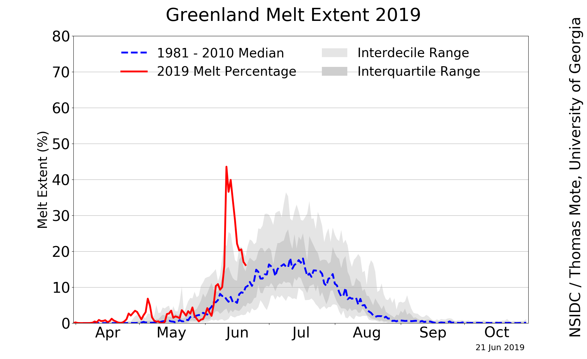

__Keywords:__ dataviz, R, GIS

Last week I started a Github repository ([Link](https://github.com/SwampThingPaul/EcoDataViz){target="_blank"})
to practice my data visualization. The data I used [last week](https://github.com/SwampThingPaul/EcoDataViz#2019-06-18-iowa-lake-microcystin-concentration){target="_blank"} was Microcystin concentration from Iowa lakes to show trends and evaluate the current year relative to the period of record. Much like [#TidyTuesday](https://github.com/rfordatascience/tidytuesday){target="_blank"}, as part of the data visualization practice I share the plots and code to spread inspiration and insight into data visualization techniques...the first post went live on [Twitter](https://twitter.com/SwampThingPaul/status/1140682305528377347){target="_blank"} last week with a pretty good reception (couple dozen *"likes"* and could of *"re-tweets"*)...couldn't have been happier! 

My Eco #DataViz is pretty basic, its not done in the tidyverse coding style or visualized in `ggplot`. Everything I do is in `base` R because that is what I am comfortable doing. The whole goal of Eco #DataViz much like #TidyTuesday is to practice **wrangling** and **visualizing** data. In general I follow the guidelines of #TidyTuesday:


 - This is NOT about criticizing the original article or graph. Real people made the graphs, collected or acquired the data! Focus on the provided dataset, learning, and improving your techniques in R.

 - This is NOT about criticizing or tearing down your fellow #RStats practitioners! Be supportive and kind to each other! Like other's posts and help promote the #RStats community!

 - Share the visualization on Twitter.

 - Include a copy of the code used to create your visualization. I attempt to comment your code wherever possible to help myself and others understand my process (I know scary)!
 
 - Focus on improving your craft, even if you end up with something simple!

 - Give credit to the original data source whenever possible.

This blog post is the next iteration of Eco #DataViz where I can provide a more in-depth look into the process, share code and data visualizations. 

***

This week I decided to move out of aquatic ecosystem and into something I have always been interested in...climate change science. Recently a version of this image has been making the rounds on [twitter](https://twitter.com/EricHolthaus/status/1139234563400634368){target="_blank"} sparking concern and interest. 

```{r, out.width="75%",echo=FALSE,fig.align="center"}

```

Being the data nerd I am I decided to dig into the data after reading [Lisa Charlotte's](http://lisacharlotterost.de/){target="_blank"} [blog](https://blog.datawrapper.de/weekly-chart-greenland-ice-melting-global-warming-2019/){target="_blank"} post on this data and some additional data visualizations of the data. Also an [r-script](https://github.com/datawrapper/snippets/tree/3a38e1d07af7a00f1f8c1acd0f29e45b5742c947/2019-06-greenland-ice-melting){target="_blank"} to pull data from the National Snow & Ice Data Center(NSIDC)! A huge thanks to the [NSIDC](http://nsidc.org/greenland-today/){target="_blank"} for making this data available! 

Before grabbing the data lets load the necessary libraries I used.

```{r ,echo=T,message=F,warning=F}
#Libraries
library(AnalystHelper)
library(plyr)
library(reshape)
library(rjson)
```

The `AnalystHelper` library is a package I put together of the functions I use on a daily basis...most are helper functions for plotting some actually pull data and others do things. Check out the package [here](https://github.com/SwampThingPaul/AnalystHelper){target="_blank"}...most likely this will never make it on CRAN but if it helps you out great!! 


Alright lets get the data...

```{r ,echo=T,message=F,warning=F}
years=seq(1979,2019,1)
green.melt=data.frame()

for(i in 1:length(years)){
  # pulls the data from the web
  d1=fromJSON(file=paste0('https://nsidc.org/api/greenland/melt_area/', years[i]));
  #puts in into a temporary file (natively its a list)
  tmp=data.frame(Date=as.Date(names(unlist(d1))), MeltArea.sqkm=unlist(d1))
  #fixes the row names
  row.names(tmp)=1:nrow(tmp)
  #combines with the prior year
  green.melt=rbind(tmp,green.melt)
}
```

You can write `green.melt` to a file if needed (i.e. `write.csv`) or use it in your process. This data represents melt area of the Greenland ice sheet in square kilometers. Granted there are some limitation to this data because it is remotely sensed data but given the period or record some valuable insights into trends and magnitude of change can be determined. If you are interesting about the data, NSIDC has an ["About the data"](http://nsidc.org/greenland-today/about-the-data/){target="_blank"} page.

Before really jumping into the data lets work with the date field (**screaming is allowed at this point**...now that is done let get to it). I use `date.fun()`, a function in `AnalystHelper` to help me format dates...I work with lots of time-series data so I made a quick helper function, check out `?date.fun` for more info. 

```{r ,echo=T,message=F,warning=F}
green.melt$Date=date.fun(green.melt$Date,tz="GMT");
green.melt$DOY=format(green.melt$Date,"%j");# Day of the Year
green.melt$CY=as.numeric(format(green.melt$Date,"%Y"));# Calendar Year
```

In the original image, the units are in percent of area...the data we just downloaded is in square kilometers. After some digging I figured out the Greenland ice-sheet is approximately 1,710,000 km^2^ so lets insert a variable 
```{r ,echo=T,message=F,warning=F}
greenland.ice.area=1710000
```

Now we can convert the melt area in km^2^ to percent area like in the original image and calculate some statistics.

```{r ,echo=T,message=F,warning=F}
green.melt$MeltArea.per=(green.melt$MeltArea.sqkm/greenland.ice.area)*100

green.melt.POR.stats=ddply(subset(green.melt,CY%in%seq(1979,2018,1)),"DOY",
                           summarise,
                           N.val=N(MeltArea.per),
                           decile.10=quantile(MeltArea.per,probs=0.1,na.rm=T),
                           decile.90=quantile(MeltArea.per,probs=0.9,na.rm=T),
                           Q25=quantile(MeltArea.per,probs=0.25,na.rm=T),
                           Q75=quantile(MeltArea.per,probs=0.75,na.rm=T),
                           median=median(MeltArea.per,na.rm=T))

green.melt.ref.stats=ddply(subset(green.melt,CY%in%seq(1981,2010,1)),"DOY",
                           summarise,
                           N.val=N(MeltArea.per),
                           median=median(MeltArea.per,na.rm=T))

```

***

## Goal: Replicate [Greenland Daily Melt Plot](https://nsidc.org/greenland-today/){target="_blank"}

```{r,echo=FALSE,fig.width=6,fig.height=4,fig.align='center',fig.cap="Calendar year 2019 Greenland surface melt extent relative to the 1979 to 2018 period of record."}

ylim.val=c(0,100);by.y=20;ymaj=seq(ylim.val[1],ylim.val[2],by.y);ymin=seq(ylim.val[1],ylim.val[2],by.y/2)
date.range=as.Date(c("2019-04-01","2019-11-01"));xmaj.date=seq(date.range[1],date.range[2],"2 months");xmin.date=seq(date.range[1],date.range[2],"1 months")
xlim.val=as.numeric(format(date.range,"%j"));xmaj=as.numeric(format(xmaj.date,"%j"));xmin=as.numeric(format(xmin.date,"%j"))
xlab=format(xmaj.date, format="%b")

par(family="serif",mar=c(1.5,2,0.1,0.1),oma=c(2,1.75,0.5,1));
layout(matrix(1:2,1,2,byrow=T),widths=c(1,0.5))

plot(median~DOY,green.melt.POR.stats,axes=F,ylab=NA,xlab=NA,ylim=ylim.val,xlim=xlim.val,type="n",yaxs="i")
abline(h=ymaj,v=xmaj,lty=3,col="grey80")
with(green.melt,points(DOY,MeltArea.per,pch=21,bg=adjustcolor("grey80",0.1),col=adjustcolor("grey",0.5),lwd=0.5,cex=0.7))
with(green.melt.POR.stats,shaded.range(DOY,decile.10,Q25,"dodgerblue1",lty=0))
with(green.melt.POR.stats,shaded.range(DOY,Q75,decile.90,"dodgerblue1",lty=0))
with(green.melt.POR.stats,shaded.range(DOY,Q25,Q75,"indianred1",lty=0))
with(green.melt.ref.stats,lines(DOY,median,col="blue",lwd=2,lty=2))
with(subset(green.melt,CY==2019),lines(DOY,MeltArea.per,col="red",lwd=2))
axis_fun(2,ymaj,ymin,ymaj)
axis_fun(1,line=-0.5,xmaj,xmin,xlab);
box(lwd=1)
mtext(side=2,line=2,"Melt Area (% of Greenland Ice Sheet)")
mtext(side=1,line=2,"Day of the Year")

plot(0:1,0:1,type = 'n', axes = F,xlab=NA, ylab=NA)
legend.text=c("Data","Interdecile Range","Interquantile Range","1980 - 2010 Median", "2019 Data")
legend(0.5,0.5,legend=legend.text,pch=c(21,22,22,NA,NA),col=c(adjustcolor("grey",0.5),NA,NA,"blue","red"),lwd=1.5,lty=c(NA,NA,NA,2,1),pt.bg=c(adjustcolor("grey80",0.1),adjustcolor("dodgerblue1",0.25),adjustcolor("indianred1",0.25),"blue","red"),pt.cex=1.5,ncol=1,cex=0.8,bty="n",y.intersp=1.75,x.intersp=0.75,xpd=NA,xjust=0.5,yjust=0.5)
text(1,0.1,adj=1,font=3,cex=0.5,xpd=NA,"\u00B9 Data from National Snow and Ice Data Center.\n\n \u00B2  Based on ice sheet area of 1.71 x 10\u2076 km\u00B2.\n\n \u00B3 Interdecile Range (10th - 90th quantile)\n and Interquantile range (25th to 75th quantile)\n based on 1979 - 2018 period.")

```

**DONE!** and with some added flair. 

While digging through the data a couple of questions come to mind...here are two. 

## Q~1~ Has the average trend in Greenland melt area increased?

To answer this question we need to calculate annual mean melt area across the period of record. I also included a calculation of $\pm$ 95% Confidence Interval. I limited the data to just years with a full amount of data and since we are in the middle of the year, 2019 was excluded. `N()` is a function in `AnalystHelper` essentially `length(which(x!=NA))` to give an actual count of the data...check out `?AnalystHelper::N`.   

```{r ,echo=T,message=F,warning=F}
alpha=0.95;
greenland.melt.mean=ddply(subset(green.melt,CY%in%seq(1979,2018,1)),"CY",
                          summarise,
                          mean.val=mean(MeltArea.sqkm,na.rm=T),
                          sd.val=sd(MeltArea.sqkm,na.rm=T),
                          N.val=N(MeltArea.sqkm))

#Degree of freedom
greenland.melt.mean$Df=greenland.melt.mean$N.val-1; 
#Test Statistic
greenland.melt.mean$Tp=with(greenland.melt.mean,abs(qt(1-alpha,Df))); 
#Lower CI
greenland.melt.mean$LCI=with(greenland.melt.mean,
                             mean.val-sd.val*(Tp/sqrt(N.val))); 
#Upper CI
greenland.melt.mean$UCI=with(greenland.melt.mean,
                             mean.val+sd.val*(Tp/sqrt(N.val))); 

```


```{r,echo=FALSE,fig.width=6,fig.height=4,fig.align='center',fig.cap="Annual average Greenland melt area with 95% confidence interval for calendar year 1979 to 2018."}
ylim.val=c(2.5e4,2.5e5);by.y=5e4;ymaj=seq(ylim.val[1],ylim.val[2],by.y);ymin=seq(ylim.val[1],ylim.val[2],by.y/2)
xlim.val=c(1979,2019);by.x=5;xmaj=seq(xlim.val[1],xlim.val[2],by.x);xmin=seq(xlim.val[1],xlim.val[2],by.x/by.x)

par(family="serif",mar=c(1.5,2,0.1,0.1),oma=c(2,1.75,0.5,1));

plot(mean.val~CY,greenland.melt.mean,axes=F,ylab=NA,xlab=NA,ylim=ylim.val,xlim=xlim.val,type="n")
abline(h=ymaj,v=xmaj,lty=3,col="grey80")
with(greenland.melt.mean,shaded.range(CY,LCI,UCI,"grey",lty=1))
with(greenland.melt.mean,lines(CY,mean.val,col="indianred1",lwd=1.5))
with(greenland.melt.mean,points(CY,mean.val,pch=21,bg="indianred1",lwd=0.1))
axis_fun(2,ymaj,ymin,ymaj/1e4)
axis_fun(1,line=-0.5,xmaj,xmin,xmaj);
box(lwd=1)
mtext(side=2,line=2.5,"Mean Greenland Ice Melt Area (x10\u2074 km\u00B2)")
mtext(side=1,line=2.0,"Calendar Year")
legend("topleft",legend=c("Annual Mean","\u00B1 95% CI"),pch=c(21,22),col=c("black","grey"),lwd=0.1,lty=c(NA,NA),pt.bg=c("indianred1",adjustcolor("grey",0.25)),pt.cex=1.5,ncol=1,cex=0.8,bty="n",y.intersp=1.75,x.intersp=0.75,xpd=NA,xjust=0.5,yjust=0.5)
text(xlim.val[2]+3,ylim.val[1]-5.75e4,adj=1,font=3,cex=0.5,xpd=NA,"\u00B9 Data from National Snow and Ice Data Center.")
```

Now to see if this trend is significant we can apply a basic Kendall correlation analysis.

```{r, echo=T}
with(greenland.melt.mean,cor.test(mean.val,CY,method="kendall"))
```

I would say the annual mean melt area has significantly increased over the entire period of record!! 

## Q~2~ Has the peak melt area increased during the period of record?

Let figure out when the peak melt area has occurred every year. I did this by looping through each year to find the max melt area and extract the date/DOY.  

```{r ,echo=T,message=F,warning=F}
max.melt.CY=data.frame()
for(i in 1:length(seq(1979,2018,1))){
  CY.max=max(subset(green.melt,CY==years[i])$MeltArea.sqkm,na.rm=T)
  tmp.dat=subset(green.melt,CY==years[i]&MeltArea.sqkm==CY.max)
  
  tmp.dat.final=data.frame(CY=years[i],
                           DOY.max.melt=as.numeric(min(tmp.dat$DOY,na.rm=T)),
                           max.melt=CY.max)
  max.melt.CY=rbind(tmp.dat.final,max.melt.CY)
}
```


```{r,echo=FALSE,fig.width=6,fig.height=4,fig.align='center',fig.cap="Day of max melt area between calendar year 1979 to 2018."}
ylim.val=c(150,249);by.y=30;ymaj=seq(ylim.val[1],ylim.val[2],by.y);ymin=seq(ylim.val[1],ylim.val[2],by.y/2)
xlim.val=c(1979,2019);by.x=5;xmaj=seq(xlim.val[1],xlim.val[2],by.x);xmin=seq(xlim.val[1],xlim.val[2],by.x/by.x)

par(family="serif",mar=c(1.5,4.5,0.1,0.1),oma=c(2,1.75,0.5,1));
plot(DOY.max.melt~CY,max.melt.CY,axes=F,ylab=NA,xlab=NA,ylim=ylim.val,xlim=xlim.val,type="n")
abline(h=ymaj,v=xmaj,lty=3,col="grey80")
with(max.melt.CY,lines(CY,DOY.max.melt,lty=2,lwd=1.5,col="dodgerblue1"))
with(max.melt.CY,points(CY,DOY.max.melt,pch=21,lwd=0.01,cex=1.25,bg="dodgerblue1"))
axis_fun(1,line=-0.5,xmaj,xmin,xmaj)
axis_fun(2,ymaj,ymin,format(as.Date(ymaj,origin="2018-01-01"),"%B %d"))# convert DOY to a date.
box(lwd=1)
mtext(side=1,line=2,"Calendar Year")
mtext(side=2,line=4.25,"Day of Peak Melt")
```

Lots of variability in the data with some years occurring relatively yearly and others later in the year. More digging is needed to pull this trend out and mechanisms behind it...exciting (and worrisome) frontiers in Arctic and data science. 

***