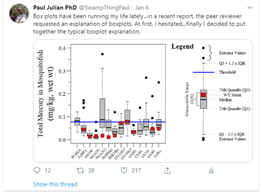

__Keywords:__ boxplots, outlier, data analysis

***

```{r, message=F,warning=F,include=F}
#Libraries/packages needed
library(AnalystHelper)

CurlyBraces <- function(x, y, min.val,max.val, pos = 1, direction = 1 ,b=c(0,.2,.28,.7,.8),a=c(1,2,3,48,50)) {
  # a set flexion point for spline
  # b set depth for spline flexion point
  curve = spline(a, b, n = 50, method = "natural")$y / 2 
  curve = c(curve,rev(curve))
  
  a_sequence = rep(x,100)
  b_sequence = seq(min.val,max.val,length=100)  
  
  # direction
  if(direction==1)
    a_sequence = a_sequence+curve
  if(direction==2)
    a_sequence = a_sequence-curve
  
  # pos
  if(pos==1)
    lines(a_sequence,b_sequence) # vertical
  if(pos==2)
    lines(b_sequence,a_sequence) # horizontal
  
}

```

In a recent commentary due out in [Marine Biology](https://www.springer.com/journal/227){target="_blank"} soon (hopefully) I argue against the  use of boxplots as a method of outlier detection. Also seems that boxplots are very popular with people having strong opinons ...

```{r, out.width="50%",echo=FALSE,fig.align="center"}

```


Before we get too into the weeds lets present the classical definition of what an outlier is, here I use @gotelli_primer_2013 but across statistical literature outliers are generally defined/described similarly.

>"...extreme data points that are not characteristic of the distribution they were sampled..." [@gotelli_primer_2013].

What would a classic example of this definition look like in "real data" (below is generated data...technically not real data)?

Here is how the data was generated for demonstration purposes

```{r, include=T}
set.seed(123)
# "Data
N.val<-100
x.val<-seq(0,1,length.out=N.val)
m<-5
b<-1
error.val<-1
y.val<-((m*x.val)+b)+rnorm(N.val,0,error.val)

# Outlier
y.val.out<-y.val[95]+2.5

```

```{r,echo=FALSE,fig.width=5,fig.height=2.75,fig.align='center',fig.cap="Visual example of an outlier based on the definition above."}
# Simulate the data

#plots
par(family="serif",mar=c(1,2,0.1,0.5),oma=c(0,1,1,1));
layout(matrix(1:2,1,2))

xlim.val=c(-0.1,1.5);by.x=0.5;xmaj=seq(xlim.val[1],xlim.val[2],by.x);xmin=seq(xlim.val[1],xlim.val[2],by.x/2);
ylim.val=c(-0.5,11);by.y=2;ymaj=seq(ylim.val[1],ylim.val[2],by.y);ymin=seq(ylim.val[1],ylim.val[2],by.y/2);

plot(y.val~x.val,type="n",ylim=ylim.val,xlim=xlim.val,ylab=NA,xlab=NA,axes=F,yaxs="i",xaxs="i")
points(y.val~x.val,pch=21,bg="grey",lwd=0.1)
points(x.val[50],y.val.out,pch=21,bg="red")
axis_fun(1,xmaj,xmin,NA)
axis_fun(2,ymaj,ymin,NA)
mtext(side=3,"Scatterplot of data")
den=density(y.val)
xlim.val=c(-2,11);by.x=2;xmaj=seq(xlim.val[1],xlim.val[2],by.x);xmin=seq(xlim.val[1],xlim.val[2],by.x/2);
ylim.val=c(0,0.3);by.y=0.1;ymaj=seq(ylim.val[1],ylim.val[2],by.y);ymin=seq(ylim.val[1],ylim.val[2],by.y/2);
plot(0:1,0:1,type="n",ylim=ylim.val,xlim=xlim.val,ylab=NA,xlab=NA,axes=F,yaxs="i",xaxs="i")
polygon(den,col=adjustcolor("dodgerblue1",0.5),border="dodgerblue1")
abline(v=y.val.out,lty=1,col="red",lwd=2)
abline(v=mean(y.val),lty=2)
text(y.val.out-0.2,0.29,"Extreme Value",adj=1,font=3,cex=0.75)
text(mean(y.val)-0.2,0.28,"Mean",adj=1,font=3,cex=0.75)
axis_fun(1,xmaj,xmin,NA)
axis_fun(2,ymaj,ymin,NA)
mtext(side=3,"Density Plot")

```

Clearly, based on the example above it seems like the <span style="red">red</span> point in the plot to the left looks like it doesn't really belong. A quick density plot of the data with and without the point (use `plot(density(...))`) gives you a sense of if the extreme data point is outside of the data distribution. The plot to the right demonstrates the data distribution and mean (dashed) without the extreme value relative to the extreme value (<span style="red">red</span> line).

The next step to really determine if its an outlier would be to conduct an outlier test on your data. Outliers in data can distort the data distribution, affect predictions (if used in a model) and affect the overall accuracy of estimates if they are not detected and handled, especially in bi-variate analysis (such as linear modeling). Most of the information you will see on the internet and in some textbooks is that boxplots are good way to identify outliers. I fully endorse using boxplots as a first looks at the data, just to get a sense of things as they were intended by @tukey_exploratory_1977. Thats right [Dr. John W Tukey](https://en.wikipedia.org/wiki/John_Tukey){target="_blank"} was the mastermind behind the boxplot...you may remember him from such statistical analyses as [Tukey's range test/HSD](https://en.wikipedia.org/wiki/Tukey%27s_range_test){target="_blank"} or [Tukey lambda distribution](https://en.wikipedia.org/wiki/Tukey_lambda_distribution){target="blank"}.   

Overall, boxplots are extremely helpful in quickly visualization of the central tendency and spread of the data. Don't confuse the central tendency and spread for mean and standard deviation, as these values are not usually displayed in boxplots.   

```{r,echo=FALSE,fig.width=4.5,fig.height=4,fig.align='center',fig.cap="Components of a classic Tukey boxplot."}
set.seed(1)
fake.dat=rnorm(1000)

par(family="serif",mar=c(0.5,0.5,0.5,0.5),oma=c(1,1,1,1))
x=boxplot(fake.dat,col="grey",pch=21,bg="black",axes=F,boxwex=0.3,xlim=c(0.5,2))
lines(c(1.07,1.3),rep(x$stats[1,],2),lty=2,col="grey75")
text(1.3,x$stats[1,],"Q1 - 1.5 x IQR",xpd=NA,pos=4,cex=0.75)
lines(c(1.07,1.3),rep(x$stats[2,],2),lty=2,col="grey75")
text(1.3,x$stats[2,],"25th Quantile (Q1)",xpd=NA,pos=4,cex=0.75)
text(1.3,x$stats[3,],"Median",xpd=NA,pos=4,cex=0.75)
lines(c(1.07,1.3),rep(x$stats[3,],2),lty=2,col="grey75")
text(1.3,x$stats[4,],"75th Quantile (Q3)",xpd=NA,pos=4,cex=0.75)
lines(c(1.07,1.3),rep(x$stats[4,],2),lty=2,col="grey75")
text(1.3,x$stats[5,],"Q3 + 1.5 x IQR",xpd=NA,pos=4,cex=0.75)
lines(c(1.07,1.3),rep(x$stats[5,],2),lty=2,col="grey75")
text(0.65,x$stats[2,]+diff(x$stats[c(2,4),])/2,srt=90,"Interquantile Range\n(IQR)",adj=0.5,xpd=NA,cex=0.75)
CurlyBraces(0.9,x$stats[2,]+diff(x$stats[c(2,4),])/2,x$stats[2,],x$stats[4,],b=c(0,0.2,0.28,0.7,0.8)/7.5,direction=2)
CurlyBraces(1.1,mean(x$out[x$out>0]),min(x$out[x$out>0]),max(x$out[x$out>0]),
            b=c(0,0.2,0.28,0.7,0.8)/7.5,direction=1)
text(1.3,mean(x$out[x$out>0]),"Extreme Values",xpd=NA,cex=0.75,pos=4)
text(1.3,mean(x$out[x$out<0]),"Extreme Values",xpd=NA,cex=0.75,pos=4)
```

At its root, boxplots providing no information on the underlying data distribution and provide a somewhat arbitrary detection of extreme values especially for non-normal data distributions [@kampstra_beanplot:_2008; @krzywinski_visualizing_2014]. Extreme values are identified using a univariate boxplot simply identifies values that fall outside of 1.5 time the inter-quartile range (IQR) of the first or third quartile [@tukey_exploratory_1977]. As discussed above, outliers are extreme values outside the distribution of the data. Since IQR (i.e. median, 25th quantile, 75th quantile, etc.) calculations are distributionless calculations, values outside the IQR therefore are not based on any distribution. Below are four examples of data pulled from different distributions with a mean of zero ($\mu = 0$) and standard deviation of one ($\sigma = 1$). In these cases, especially for normally and skewed normal distributions, median, 25^th^ quantile and 75^th^ quantile values do not differ greatly, but the number of outliers do differ.

```{r,message=F,warning=F,include=F}
set.seed(1)
nval=10000
library(fGarch)
rand.unif=runif(nval,-2,2)
rand.norm=rnorm(nval)
rand.sqnorm=rsnorm(n=nval)
rand.sqnorm2=rsnorm(n=nval,xi=2.5)
```


```{r,echo=FALSE,fig.width=3.5,fig.height=5,fig.align='center',fig.cap="Boxplot and distribution plots of uniform, normal and skewed normal distributions with \u03BC = 0 and \u03C3 = 1 (mean and standard deviation) and an N = 10,000."}
par(family="serif",mar=c(1.25,2,1.25,0.5),oma=c(2,1,1,1));
layout(matrix(1:4,4,1))

xlim.val=c(-5,5);by.x=2.5;xmaj=seq(xlim.val[1],xlim.val[2],by.x);xmin=seq(xlim.val[1],xlim.val[2],by.x/2)
boxplot(rand.unif,horizontal =T,ylim=xlim.val,xlim=c(0.25,1.25),axes=F,xaxs="i",boxwex=0.5)
x.vals=seq(-4,4,length.out=10000)
polygon(x.vals,dunif(x.vals, min = -2, max = 2)+0.25,col=adjustcolor("dodgerblue1",0.5),border="dodgerblue1")
#lines(x.vals,dunif(x.vals, min = -2, max = 2)+0.25,col="blue")
axis_fun(1,xmaj,xmin,NA)
mtext(side=3,"Uniform")
#abline(v=quantile(rand.unif,probs=c(0.25,0.5,0.75)),lty=2,col="grey")
#mtext(side=1,line=-1.25,paste("Uniform (\u03BC =",round(mean(rand.unif),0),"; \u03C3 =",round(sd(rand.unif),0),")"))

boxplot(rand.norm,horizontal =T,ylim=xlim.val,xlim=c(0.25,1.25),pch=21,bg=adjustcolor("grey",0.5),axes=F,xaxs="i",cex=2,boxwex=0.5)
polygon(x.vals,dnorm(x.vals)+0.25,col=adjustcolor("dodgerblue1",0.5),border="dodgerblue1")
#lines(x.vals,dnorm(x.vals )+0.25,col="blue")
axis_fun(1,xmaj,xmin,NA)
mtext(side=3,"Normal")
#abline(v=quantile(rand.norm,probs=c(0.25,0.5,0.75)),lty=2,col="grey")
#mtext(side=1,line=-1.25,paste("Normal (\u03BC =",round(mean(rand.norm),0),"; \u03C3 =",round(sd(rand.norm),0),")"))

boxplot(rand.sqnorm,horizontal =T,ylim=xlim.val,xlim=c(0.25,1.25),pch=21,bg=adjustcolor("grey",0.5),axes=F,xaxs="i",cex=2,boxwex=0.5)
polygon(x.vals,dsnorm(x.vals)+0.25,col=adjustcolor("dodgerblue1",0.5),border="dodgerblue1")
#lines(x.vals,dsnorm(x.vals)+0.25,col="blue")
axis_fun(1,xmaj,xmin,NA)
mtext(side=3,"Skewed Normal (x\u1D62 = 1.5)")
#abline(v=quantile(rand.sqnorm,probs=c(0.25,0.5,0.75)),lty=2,col="grey")
#mtext(side=1,line=-1.25,paste("Skewed Normal (\u03BC =",round(mean(rand.sqnorm),0),"; \u03C3 =",round(sd(rand.sqnorm),0),")"))

boxplot(rand.sqnorm2,horizontal =T,ylim=xlim.val,xlim=c(0.25,1.25),pch=21,bg=adjustcolor("grey",0.5),axes=F,xaxs="i",cex=2,boxwex=0.5)
polygon(x.vals,dsnorm(x.vals,xi=2.5)+0.25,col=adjustcolor("dodgerblue1",0.5),border="dodgerblue1")
#lines(x.vals,dsnorm(x.vals,xi=2.5)+0.25,col="blue")
axis_fun(1,xmaj,xmin,format(xmaj))
mtext(side=3,"Skewed Normal (x\u1D62 = 2.5)")
#abline(v=quantile(rand.sqnorm2,probs=c(0.25,0.5,0.75)),lty=2,col="grey")
#mtext(side=1,line=-1.25,paste("Skewed Normal (\u03BC =",round(mean(rand.sqnorm),0),"; \u03C3 =",round(sd(rand.sqnorm),0),")"))
mtext(side=1,line=1.75,"Value")

```

The boxplot examples above show the span of over 10,000 values pulled from uniform, normal and skewed normal distribtuions. A directly obvious observations is that the uniform distribition does not generate any extreme values while the others generate some depending on the skewness of the distributions. @kampstra_beanplot:_2008 suggests that even for normal distributions the number of extreme values identified will increase concurrently with sample size. This is demonstrated below where as sample size increases, the number of extreme values identified also increases. Furthermore, as sample size increases the IQR estimates narrows which you would expect given the central limit theorem. This sample size dependance ultimately makes individual "outlier" detection problematic.    

```{r,echo=F,include=F}
set.seed(1)
#Synthetic dataset
testIQR<-data.frame()
for(i in seq(1,5000,2)){
  tmp<-rnorm(i)
  q.val<-quantile(tmp,c(0.25,0.5,0.75))
  IQR<-as.numeric((q.val[3]-q.val[1]))
  N.out<-N(boxplot(tmp,plot=F)$out)
  testIQR<-rbind(testIQR,data.frame(samp=i,IQR.val=IQR,N.out=N.out))
}
```

```{r,echo=F,fig.width=4.5,fig.height=5.5,fig.align='center',fig.cap="Number of potential outliers detected using a univariate boxplot (top) and inter-quartile range as a function of sample size (bottom) from a normally distributed simulated dataset with a mean of zero and a standard deviation of one (\u03BC  = 0; \u03C3 = 1)."}


par(family="serif",mar=c(1,3.5,0.5,0.5),oma=c(2.5,1,0.25,0.75));
layout(matrix(c(1:2),2,1,byrow=T))

xlim.val<-c(0,5000);by.x<-2000;xmaj<-seq(xlim.val[1],xlim.val[2],by.x);xmin<-seq(xlim.val[1],xlim.val[2],by.x/2)
ylim.val<-c(0,60);by.y<-20;ymaj<-seq(ylim.val[1],ylim.val[2],by.y);ymin<-seq(ylim.val[1],ylim.val[2],by.y/2)
plot(N.out~samp,testIQR,type="n",ylim=ylim.val,xlim=xlim.val,ylab=NA,xlab=NA,axes=F)
abline(h=ymaj,v=xmaj,lty=3,col="grey")
with(testIQR,points(samp,N.out,pch=21,col=adjustcolor("dodgerblue1",0.5),bg=adjustcolor("dodgerblue1",0.25),lwd=0.5,cex=0.75))
axis_fun(1,line=-0.5,xmaj,xmin,xmaj)
axis_fun(2,ymaj,ymin,format(ymaj));box(lwd=1)
mtext(side=2,line=2.75,"Number of Outliers")

xlim.val<-c(0,5000);by.x<-2000;xmaj<-seq(xlim.val[1],xlim.val[2],by.x);xmin<-seq(xlim.val[1],xlim.val[2],by.x/2)
ylim.val<-c(0,2);by.y<-0.5;ymaj<-seq(ylim.val[1],ylim.val[2],by.y);ymin<-seq(ylim.val[1],ylim.val[2],by.y/2)
plot(IQR.val~samp,testIQR,type="n",ylim=ylim.val,xlim=xlim.val,ylab=NA,xlab=NA,axes=F)
abline(h=ymaj,v=xmaj,lty=3,col="grey")
with(testIQR,points(samp,IQR.val,pch=21,col=adjustcolor("indianred1",0.5),bg=adjustcolor("indianred1",0.25),lwd=0.5,cex=0.75))
axis_fun(1,line=-0.5,xmaj,xmin,xmaj)
axis_fun(2,ymaj,ymin,format(ymaj));box(lwd=1)
mtext(side=2,line=2.5,"Inter-quartile Range")
mtext(side=1,line=1.75,"Sample Size")

```


Bottom line, a boxplot is not a suitable outlier detection test but rather an exploratory data analysis to understand the data. While boxplots do identify extreme values, these extreme values are not truely outliers, they are just values that outside a _distribution-less_ metric on the near extremes of the IQR. Outlier tests such as the Grubbs test, Cochran test or even the Dixon test all can be used to idenify outliers. These tests and more can be found in the `outlier` `R` package. Outlier identification and culling is a tricky situtation and requires a strong and rigirous justification and validation that data points identified as an outlier is truely an outlier otherwise you can run afoul of type I and/or type II errors.    


## References