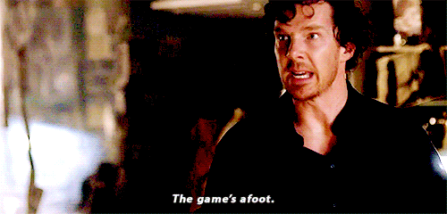

  
__Keywords:__ R, spatial data, coordinates

    There is nothing more deceptive than an obvious fact.
    - Arthur Conan Doyle, The Boscombe Valley Mystery

```{r setup, include=FALSE}
knitr::opts_chunk$set(echo = TRUE)

library(rgdal)
```

If you haven't heard already, big changes are afoot in the [R-spatial](https://rspatial.org/){target="_blank"} community. 
```{r, out.width="50%",echo=FALSE,fig.align="center"}

```

...if you were/are like me you experienced a mix of emotions. But not to worry there are loads of resources and a people working the issues right now. 

```{r, out.width="40%",echo=FALSE,fig.align="center"}

```

...so expect lots of blog posts and resources from people.

***

The cliff notes version (short, short version) is that changes in the representation of coordinate reference systems (CRS) have finally caught up with how spatial data is handled in R packages. In a vignette, [Roger Bivand](https://twitter.com/RogerBivand){target="_blank"} explains the nitty gritty title [_"Why have CRS, projections and transformations"_](https://rgdal.r-forge.r-project.org/articles/CRS_projections_transformations.html){target="_blank"}.

* YouTube lecture by Roger Bivand ([link](https://youtu.be/2H1Tn4oN32M){target="_blank"})
* Associated material ([link](https://rsbivand.github.io/ECS530_h20/ECS530_III.html){target="_blank"})
* Bivand, R.S. Progress in the R ecosystem for representing and handling spatial data. J Geogr Syst (2020). [https://doi.org/10.1007/s10109-020-00336-0](https://doi.org/10.1007/s10109-020-00336-0){target="_blank"}

Roger also penned this post explaining the migration specific for the `rgdal`, `sp` and `raster` packages specific to read, write, project, and transform objects using PROJ strings ([_"Migration to PROJ6/GDAL3"_](https://cran.r-project.org/web/packages/rgdal/vignettes/PROJ6_GDAL3.html#Migration_to_PROJ6GDAL3){target="_blank"}). It gets rather complex but a good resource.  

In another resource I came across in my sleuthing and troubleshooting Edzer Pebesma and Roger Bivand discusses how [GDAL](https://gdal.org/){target="_blank"} and [PROJ](https://proj.org){target="_blank"} (formerly
proj.4) relates to geospatial tools including several `R` packages in a post [_"R spatial follows GDAL and PROJ developement"_](https://www.r-spatial.org/r/2020/03/17/wkt.html){target="_blank"}. As an example they outline the dependency for package sf is for instance pictured here:

```{r, out.width="75%",echo=FALSE,fig.align="center"}
knitr::include_graphics("https://keen-swartz-3146c4.netlify.com/images/sf_deps.png")
```

Also something worth reiterating here, briefly: 

* PROJ provides methods for coordinate representation, conversion
(projection) and transformation, and

* GDAL allows reading and writing of spatial raster and vector data
in a standardized form, and provides a high-level interface to PROJ
for these data structures, including the representation of coordinate reference systems (CRS)

***

We are ultimately dealing with coordinate reference systems (or CRS) but it also goes by another name...spatial reference system (SRS). This might make more sense soon. As summarized by [INBO](https://github.com/inbo){target="_blank"}, CRS are defined by several elements:

* a coordinate system,
* a ‘datum’; it localizes the geodetic coordinate system relative to the Earth and needs a geometric definition of the ellipsoid,
* only for projected CRSes: coordinate conversion parameters that determine the conversion from the geodetic to the projected coordinates.

[INBO](https://github.com/inbo){target="_blank"} did a fantastic tutorial ([https://inbo.github.io/tutorials/tutorials/spatial_crs_coding/](https://inbo.github.io/tutorials/tutorials/spatial_crs_coding/){target="_blank"}) on the changes walking through the how-to for `sp`, `sf` and `raster` packages. The `rgdal` package leans heavily on the `sp` package...incase you were worried.  

***

Here are some examples and things that I have learned dealing with this issue. Nothing special and I suggest visiting the resources identified above (especially [https://inbo.github.io/tutorials/tutorials/spatial_crs_coding/](https://inbo.github.io/tutorials/tutorials/spatial_crs_coding/){target="_blank"}). I am partial to the `sp` and `rgdal` packages, this is what I initially learned and got comfortable using. So lets load `rgdal`.

```{r,warning=FALSE,message=FALSE}
library(rgdal)
```

In the good'ol days you could define a CRS with this

```
utm17 <- CRS("+proj=utm +zone=17 +ellps=GRS80 +towgs84=0,0,0,0,0,0,0 +units=m +no_defs")
```

Do this now and you get...

```{r,echo=F}
utm17 <- CRS("+proj=utm +zone=17 +ellps=GRS80 +towgs84=0,0,0,0,0,0,0 +units=m +no_defs")
```

There might be several ways to do this but the easiest I found is 

```{r,eval=F}
utm17 <- CRS(SRS_string="EPSG:4326")
```
Notice the the argument `SRS_string` ... as in spatial reference system! (I just picked that up writing this post).

Another thing in the update is the use of WKT (well-known text) over that of PROJ strings. WKT strings are interesting and provides lots of good information on the CRS (or SRS) if your into that kind of thing. To make a WKT you use the `wkt()` function.

```{r}
utm17 <- CRS(SRS_string="EPSG:4326")

utm17.wkt=wkt(utm17)
utm17.wkt

```

or you can print the WKT to be more readable/organized with:

```{r}
cat(utm17.wkt)
```

Further down the road when you are doing analyses or even plotting in some packages (i.e. `tmap`) you might get a bunch of warnings like:

```
Warning message:
In sp::proj4string(obj) : CRS object has comment, which is lost in output
```

This shouldn't stop any of the operations but you can "mute" the warnings by running `options("rgdal_show_exportToProj4_warnings"="none")` in your console. I keep my "un-muted" to make sure I don't inadvertently miss something.  

If your wanting to transform a dataset from one datum to another you will need to use the WKT string. For instance I use several different state agency spatial datasets, one of which uses `NAD83 HARN` (which is a discarded datum...still learning about what this means) and I usually work in `UTM`. I find UTM CRSes easier to work with in general. Going back to the example dataset...if I read the file into `R` I get:

```
dat<-readOGR(shapefile) #just as an example

Warning message:
In OGRSpatialRef(dsn, layer, morphFromESRI = morphFromESRI, dumpSRS = dumpSRS,  :
  Discarded datum NAD83_High_Accuracy_Reference_Network in CRS definition: +proj=tmerc +lat_0=24.3333333333333 +lon_0=-81 +k=0.999941177 +x_0=200000.0001016 +y_0=0 +ellps=GRS80 +towgs84=0,0,0,0,0,0,0 +units=us-ft +no_defs
```

That was enough to make my head spin...but if you notice its just a warning message and it will still read the file into the `R` environment. Now to transform the CRS:

```
dat.tran<-spTransform(dat,utm17.wkt)
```

But lets say you are making a `SpatialPointsDataFrame`, one of the arguments is `proj4string` (which we are moving away from and the motivation for this whole post!).

Here is some data...
```{r}
dat2<-data.frame(SITE=c(1,2,3),
                 UTMX=c(590382,583910,585419),
                 UTMY=c(2830587,2821685,2819900))
dat2
```

```{r}
dat2.shp<-SpatialPointsDataFrame(dat2[,c("UTMX","UTMY")],
                                data=dat2,
                                proj4string=utm17)
dat2.shp

```

This is as much as I have been able to work through these changes. It's not huge large scale changes to existing workflows but enough to cause some heartburn. 

```{r, out.width="50%",echo=FALSE,fig.align="center"}

```

Hope this was helpful (sorry for all the Sherlock gifs)...keep coding friends. 

```{r, out.width="40%",echo=FALSE,fig.align="center"}

```


***