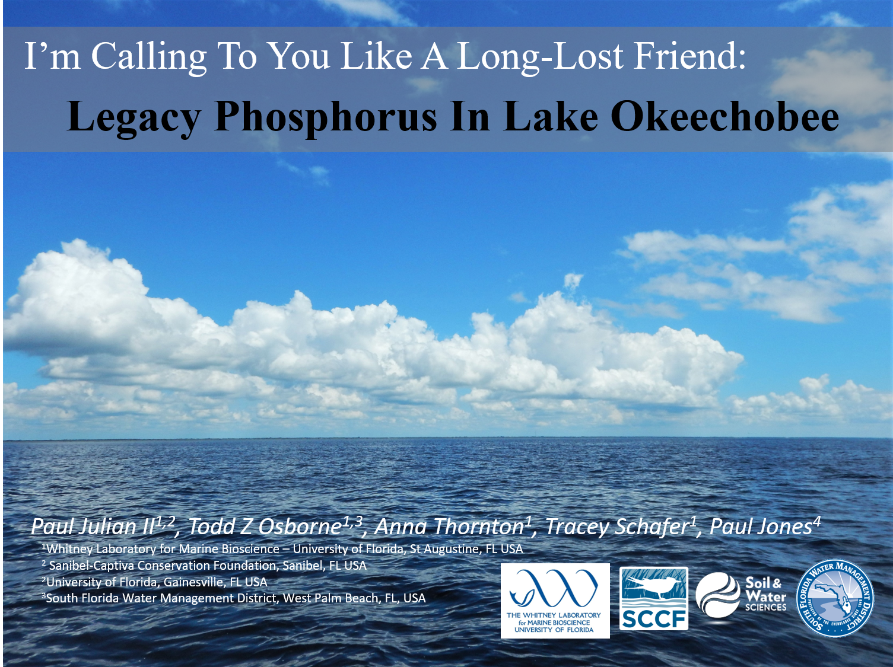
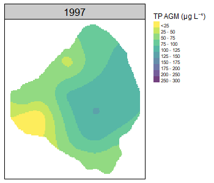
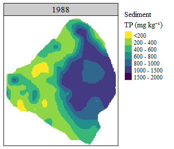

  
__Keywords:__ Okeechobee, Phosphorus, Sediments


```{r setup, include=FALSE}
knitr::opts_chunk$set(echo = TRUE)
```

```{r, out.width="50%",echo=FALSE,fig.align="center"}

```

As presented at the Greater Everglades Ecosystem Restoration Conference 2021.

Here's the almost 15 minute presentation I gave at the GEER conference on Thursday April 22, 2021 in the *Ecological Processes in Lake Okeechobee* moderated by Todd Z Osborne (University of Florida Whitney Lab) and Paul Jones (South Florida Water Management District). 

Enjoy!! 

```{r, out.width="50%",echo=FALSE,fig.align="center"}

```

[GEER 2021 Presentation - Click to Watch!](https://youtu.be/avazGnAAPco){target="_blank"}

<center> I’m Calling To You Like A Long Lost Friend: Legacy Phosphorus In Lake Okeechobee _Click to watch (it it will redirect to YouTube)_. </center>

* Nutrient inputs are highly *variable* driven by upstream inputs with potential impacts to downstream systems

* Within lake trends in nutrient are *variable* driven by ecosystem specific factors in a water - sediment feedback mechanisms. 

```{r, out.width="25%",echo=FALSE,fig.align="center"}

```

* Spatial and temporal trends in lake sediment TP concentrations are apparent with spatial trends mirroring the water column.

```{r, out.width="25%",echo=FALSE,fig.align="center"}

```

* The difference from input to output and water column to sediment is largely due to (high) internal loading.

The word of the talk was *variable* and *dynamic*, whilst these words are often over used it adequately describes the water quality and overall system biogeochemical cycling of nutrients of Lake Okeechobee.

***

**Abstract:**
Lake Okeechobee displays many features of a shallow, polymictic lake including frequent mixing of the water column and resuspension of unconsolidated sediments, and internal loading of nutrients to name a few. Additionally, the Lake has characteristically high phosphorus (P) loading due to changes in land use and drainage patterns upstream. The lake provides essential ecosystem services in the form of water supply, flood protection, navigation, and recreation, as well as vital habitat for south Florida’s flora and fauna. However, these values are threatened by current and historic excessive inputs of P influencing endo- and exogenic processes leading to fish-kills, hypoxic events, algal blooms, and degraded aquatic habitat.  

Over the last decade and a half, nutrient loading to the lake has significantly increased. Utilizing the long-term ambient monitoring network, this study evaluated water column total nitrogen (TN), total P (TP), and chlorophyll-a (Chl-a) concentrations over 23 years (May 1996 – April 2020). Water quality trends across Lake Okeechobee varied spatially with significantly declining trends in TN and Chl-a, and increasing trends in TP. Coupled with these trends the lake has notable water column nutrient gradients. Lake sediments are a long-term integrator of ecosystem conditions, over the last 30 years four lake sediment surveys have been completed. Using data from these surveys, sediment N and P concentrations were evaluated both spatially and temporally to evaluate the change in sediment nutrients throughout the Lake. Despite the lake’s shallow bathymetry and the occurrence of frequent mixing events (i.e. high winds, hurricanes, drought), lake sediments have remained relatively stable, although notable shifting in sediment TP and TN concentrations have been observed. 

The nutrient balance of Lake Okeechobee and the understanding of endo and exogenic drivers of nutrient mobilization are important to aid in the restoration of the Lake and the Greater Everglades. As restoration activities progress, it is expected that nutrient inputs to the lake will decline. However, given the volume of N and P stored in the lake's sediments, internal loading could result in delayed improvements to nutrient concentrations within the Lake. Despite the potential for delayed results continued to study and restoration activities are crucial to preserving our long-lost friend.

***