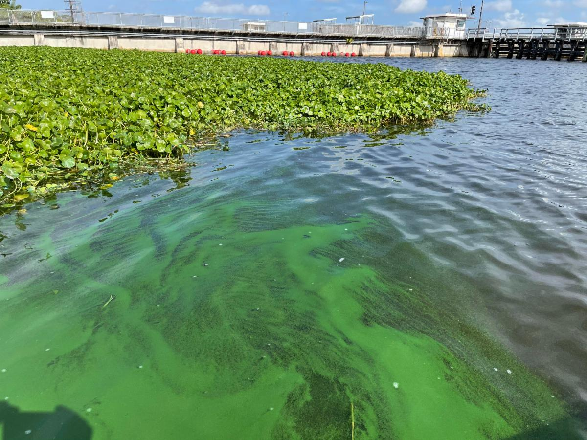
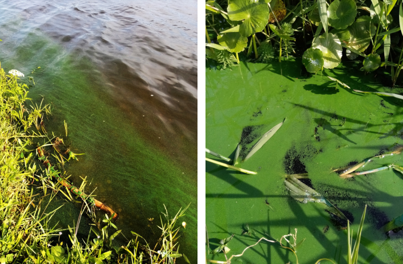

## *It’s Not Easy Being Green: Evaluating Algal Dynamics within the Okeechobee-Caloosahatchee System*

__Keywords:__ Okeechobee, Caloosahatchee, Algae


```{r setup, include=FALSE}
knitr::opts_chunk$set(echo = TRUE)
```

Original article published as a [SCCF](http://www.sccf.org/our-work/wednesday-update){target="_blank"} Wednesday Update. 

***

```{r, out.width="50%",echo=FALSE,fig.align="center"}

```

As summertime temperatures begin to warm and seasonal rains sweep across Southwest Florida, you may notice a change in conditions on the waterways. During this time of the year, the occurrence of algae within Lake Okeechobee and the Caloosahatchee River becomes more noticeable. 

Visually, algae blooms can appear as streaks of green, discolored water, or floating mats of green, blue, and white, depending on the species. Under the right conditions, some algae species when in bloom can be classified as harmful algal blooms (HABs) which produce toxins such as Microcystis (in freshwater) or Karenia brevis (in saltwater) that kill fish and other sea life. Other algae are nontoxic but also can lead to fish kills and impact benthic communities by consuming dissolved oxygen and changing the color of the water.

Over the past two decades, algal biomass (measured as suspended chlorophyll-a in the water) has significantly increased at Franklin Lock (S-79). This increase in algal biomass is important as the S-79 structure is fed by both Lake Okeechobee and the upstream C-43 canal as they discharge freshwater to the Caloosahatchee River estuary. 

Increased nutrient (nitrogen and phosphorus) loading has been identified as a major factor contributing to an increase in algal blooms in the lake and estuaries. However, within the Okeechobee-Caloosahatchee system, no one thing can be singled out as the ultimate driver of algae; rather, it’s a combination of several factors. Algal growth and bloom proliferation can be driven by several factors: light availability (how much light travels through the water column); water temperature; nutrient concentration; and hydrology (water level and discharge).

```{r, out.width="50%",echo=FALSE,fig.align="center"}

```

Currently underway, the Lake Okeechobee System Operating Manual (LOSOM) planning effort intends to change how water is managed for Lake Okeechobee. A specific topic of interest is understanding how the different water management schemes will affect the risk of algal bloom formation and transport within the Caloosahatchee and St Lucie estuaries. This metric is important to reduce the potential risk of HABs within our local waters which can lead to primary effects—fish kills and human health impacts—and secondary issues, such as environmental degradation and negative impacts on the local economy. 

To evaluate algal bloom risk to the estuaries, the U.S. Army Corps of Engineers (USACE) will compare discharges from Lake Okeechobee during the time of the year where algal bloom potential is highest (June – August). This evaluation is based on the concept of moving water with algae from Lake Okeechobee along the C-43 canal to the Caloosahatchee estuary. Based on the available data, an algal biomass transport hypothesis from the lake to the estuary does not paint the entire picture. Other processes contribute to algae bloom formation and transport within the Okeechobee-Caloosahatchee system. 

As part of the LOSOM planning effort, SCCF provided these recommendations: developing a more robust monitoring network to assess changes in algae; evaluating algal bloom potential relative to the amount of time water moves from the lake to the estuary; and including other factors, such as temperature and light availability. Ultimately, our goal is to develop an operations plan that reduces the risk of algal blooms in the estuaries and balances the needs of the Caloosahatchee and St Lucie estuaries, Lake Okeechobee, and the Southern Everglades to improve the ecology and sustainability of our system. 

By evaluating the existing science, assessing the LOSOM alternatives, and studying nutrient loading from Lake Okeechobee and the upstream basin and the resulting loads to the estuary, we are gaining a better understanding of algal dynamics within the Okeechobee-Caloosahatchee system. As water management changes for Lake Okeechobee, we continue to develop our understanding of algal and nutrient dynamics to inform management and policy decisions. 

**Hydrologic Modeler Paul Julian's position is funded jointly by SCCF and The Conservancy of Southwest Florida.**

***

More information on LOSOM can be found at the USACE LOSOM project [webpage](https://www.saj.usace.army.mil/LOSOM/){target="_blank"}